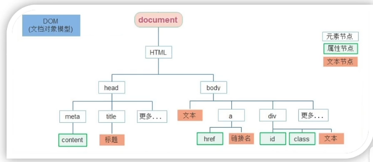
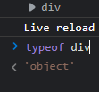
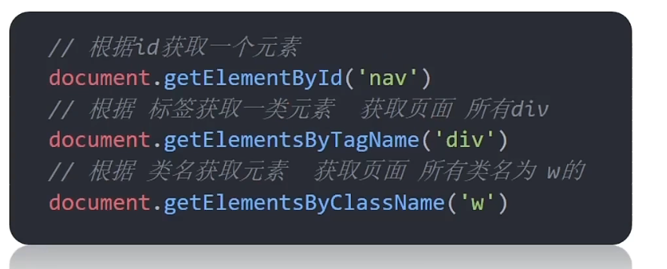

# WebAPIs

## 一、WebAPIs 基本认知

### 变量声明

+ let or const 建议 const 优先 尽量使用const 原因是：
  + const 语义化更好
  + 很多变量我们声明的时候就知道他不会更改了，那为什么不同const呢
  + 实际开发只中 也是 比如react框架  基本都是const
  + ==const 不能修改里面的值 修改就报错 但是 数组 对象 函数 的 变量都是 地址 在 堆里面 修改的是堆里面的数据 而不是栈里面的  只要地址修改  就不报错==  但是给了新对象就会报错
  + ==而简单数据类型 修改变量则是在 栈里面修改 直接修改的是值==
+ const 声明的值 不能改变，而且 const 声明变量 的时候需要进行初始化
+ ==但是对于引用数据类型 const声明的变量，里面存的 不是值  是地址。==
+ 建议 数组和对象 使用const 来声明
+ 简单数据类型  基本用let  来声明变量

### WebAPI作用和分类

+ 作用：就是使用js去操作 html和浏览器
+ 分类：DOM（文档对象模型）、BOM（浏览器对象模型）

###  什么是DOM

+ DOM（Document Object Model—— ==文档对象模型==）是用来呈现 以及与任意HTML或XML文档交互的API
+ 白话文——DOM是浏览器提供一套专门用来==操作网页内容==的功能 操作标签
+ DOM作用 
  + 开发网页内容特效 和实现用户交互


###  DOM树

+ DOM树是什么

  + 将HTML文档 以树状结构直观的表现出来，我们称之为文档或DOM树
  + 描述网页内容关系的名词
  + 作用：==文档树直观体现了标签与标签之间的关系==

  


###  DOM对象

+ DOM对象：==浏览器根据HTML标签生成的JS对象==

  + ==所有的标签属性都可以在这个对象上面找到==
  + 在html里面是标签 通过js DOM 是对象
  + 修改这个对象的属性会自动映射到标签身上

  

+ DOM核心思想

  + 把网页内容当做对象来处理

+ document 对象

  + 是DOM里面提供的一个对象
  + 所以它提供的属性和方法都是用来访问和操作网页内容的
    + 例如： document.write（）
  + 网页所有内容 都在document里面

  

  

## 二、获取DOm元素

首先选择这个标签跟css选择器类似，选中标签才能操作

+ 查找元素DOM元素就是利用JS选择页面中标签元素

学习路径

1. 根据CSS选择器来获取DOM元素（重点）
2. 其他获取DOM元素方法（了解）


### 2.1根据css选择器来获取DOM元素（重点）

1. 选择匹配的==第一个元素==

   语法：

   ==query:查询==

   ==selecor：选择器==

   ``` js
   document.querySeletor(`css选择器`)
   ```

   参数：

   包含一个或多个有效的CSS选择器 字符串

   ==返回值：==

   CSS选择器匹配的==第一个元素==，一个HTMLElement 对象

   没有匹配到 则返回null

2. 选择匹配多个元素

   ==修改元素只能通过数组的遍历==

   语法：

   ``` js
   document.querySeletorAll(`css选择器`)
   ```

   参数：

   包含一个或多个有效地CSS选择器 字符串

   ==返回值：==

   ==CSS选择器匹配的 Nodelist 对象集合==

   例如

   ``` js
   document.querySelectorAll('ul li')
   ```

   + ==得到一个伪数组：==

     + 有长度有索引号的数组
     + 但是没有pop()  push() 等数组方法

     ==想要得到里面的每一个对象，则需要遍历（for）的方式获得==

   + 哪怕只有一个元素，通过querySelectorAll（）获取过来的 也是一个伪数组，里面只有一个元素而已

###  其他获取元素的方法（了解） 淘汰




##  三、操作元素内容

+ DOM对象都是根据标签生成的，所以操作标签就是本质就是操作DOM对象
+ 就是操作对象使用的语法点
+ 如果想要修改标签元素里面的内容，则可以使用下面的几种方式
+ 学习路径：
  + 1. 对象.innerText属性
  + 2. 对象.innerHTML属性


###  元素innerText属性

+ 将文本内容添加/更新到任意标签位置

+ 显示纯文本，不解析标签 不识别标签

+ ``` js
  <div class="box">
    我是文字内容
  </div>
  <script>
      // 1.获取元素
      const box = document.querySelector('.box')
      // 2.修改文字内容 对象.innerText 属性
      console.log(box.innerText) //获取文字内容
      box.innerText = `<strong>我是一个盒子<strong>`
      //修改文字内容 不识别里面的标签
      // <strong>我是一个盒子<strong>
    </script>
  ```


### 元素.innerHTML属性

+ 将文本内容添加/更新到任意标签位置

+ 会解析标签，多标签建议使用模板字符

+ ``` js
  // 3.innerHTML 解析标签
  console.log(box.innerHTML);
  box.innerHTML = `<strong>我要更换<strong>`
  // 我要更换 加粗
  ```


#### 案例

``` js
<!DOCTYPE html>
<html lang="en">

<head>
  <meta charset="UTF-8" />
  <meta http-equiv="X-UA-Compatible" content="IE=edge" />
  <meta name="viewport" content="width=device-width, initial-scale=1.0" />
  <title>年会抽奖</title>
  <style>
    .wrapper {
      width: 840px;
      height: 420px;
      background: url(./images/bg01.jpg) no-repeat center / cover;
      padding: 100px 250px;
      box-sizing: border-box;
    }
  </style>
</head>

<body>
  <div class="wrapper">
    <strong>传智教育年会抽奖</strong>
    <h1>一等奖：<span id="one">???</span></h1>
    <h3>二等奖：<span id="two">???</span></h3>
    <h5>三等奖：<span id="three">???</span></h5>
  </div>
  <script>
    const personArr = ['周杰伦', '刘德华', '周星驰', 'Pink老师', '张学友']
    function getRandom(N, M) {
      return Math.floor(Math.random() * (M - N + 1)) + N
    }
    let random = getRandom(0, personArr.length - 1)
    // 一等奖
    // 先获取one元素
    const one = document.querySelector('#one')
    // 吧获取的元素 给 one
    one.innerHTML = personArr[random]
    // 删除数组这个名字
    personArr.splice(random, 1)
    console.log(personArr);

    // 二等奖
    // 先获取one元素
    let random1 = getRandom(0, personArr.length - 1)
    const two = document.querySelector('#two')
    // 吧获取的元素 给 one
    two.innerHTML = personArr[random1]
    // 删除数组这个名字
    personArr.splice(random1, 1)
    console.log(personArr);

    // 三等奖
    // 先获取one元素
    let random2 = getRandom(0, personArr.length - 1)
    const three = document.querySelector('#three')
    // 吧获取的元素 给 one
    three.innerHTML = personArr[random2]
    // 删除数组这个名字
    personArr.splice(random2, 1)
    console.log(personArr);

  </script>
</body>

</html>
```


## 四、操作元素属性

+ 操作元素常用属性
+ 操作元素样式属性
+ 操作表单元素属性
+ 自定义属性

### 操作元素常用属性

+ 还可以通过js来设置修改元素属性 比如通过src 更换图片

+ 最常见的属性比如说：href、title、src等

+ 语法：

  ``` js
  对象.属性 = 值
  ```

  

例如：

``` js
    
    <script>
        function getRandom(N, M) {
            return Math.floor(Math.random() * (M - N + 1)) + N
        }
        // 获取元素
        const img = document.querySelector('img')
        // 随机得到序号
        const random = getRandom(1, 6)
        // 更换路径
        img.src = `./images/${random}.webp`
    </script>
```


### ==操作元素样式属性（重点）==

+ 通过 style属性操作CSS
+ 操作类名（classNmae）操作CSS
+ 通过classList操作类控制CSS

1. ==通过style属性操作CSS==

   + ==生成的是行内样式表==
   + ==DOM对象的style 属性可控制标签style 行内样式==。

   + 语法：

     ``` js
     对象.style.样式属性 = ‘值’
     ```

2. ==操作类名（classNmae）操作CSS(适合修改样式比较多的情况)==

   + 语法

     ``` js
     元素.classNmae = ‘active’
     ```

   + 注意：

     1. 由于class是关键字 所以 用className去代替

     2. ==className是使用新值换旧值==，不保留之前的类名  

     3. 如果添加一个 类 需要保留之前的类名 例如 添加一个 box 类 之前本身有 nav 

        ``` js
                // 添加类名
                div.className = 'nav box'
        ```

3. ==通过classList 操作类控制css==

   + 为了解决className容易覆盖以前的类名，我们可以通过classList方式追加和删除类名
   + 不替换以前的类名
   + 语法：
   + ==因为追加的是类名 不需要加 .==

   ``` js
   //追加一个类
   元素.classList.add('类名')
   //删除一个类
   元素.classList.remove('类名')
   //切换一个类
   // 有就删掉 没有就加上  叫切换
   元素.classList.toggle('类名')
   // 看看有没有包含某个类  如果有返回true  没有返回false
元素.classList.contains('类名') 
   ```
   
   

###  操作表单元素的属性

+ 表单很多情况也需要修改属性，比如眼睛，可以看到密码，本质是把表单类型转换为文本框

+ 正常的属性有取值的 跟其他标签属性没有任何区别

  + 获取:DOM对象.属性名

  + 设置：DOM对象.属性名 = 新值

  + innerHTML 得不到 表单内容

  + ``` js
    表单.value = '用户名'
    表单.type = 'password'
    ```

+ 表单属性种添加就有效果，没移除就没有效果，一律使用布尔值表示，如果为true 代表添加了该属性，如果是false 代表移除了 该属性 ==比如 disabled、 checked 、selected 这几个属性只接受 布尔值==

+ checked 默认 true  默认选上

+ disabled 默认 false  不禁用

+ selected 默认 false 选中 


###  自定义属性

+ 自定义属性：

  + 在html5 种推出了 专门的 data-自定义属性

  + 在标签上一律 以 data- 开头

  + ==在DOM对象上一律以dataset 对象方式获取==

  + ``` js
        <div data-id="1" data-spm="不知道">1</div>
        <div data-id="1">2</div>
        <div data-id="1">3</div>
        <div data-id="1">4</div>
        <div data-id="1">5</div>
        <script>
            const one = document.querySelector('div')
            // dataset data集合
            console.log(one.dataset.id);
            console.log(one.dataset.spm);
        </script>
    ```

## 五、定时器的间歇函数

+ 每隔一段时间需要自动执行一段代码 
+ 定时函数有两种  另一种在Windows对象中存着

###  间歇函数

1. 开启定时器

   + ``` js
     setInterval(函数名，间隔时间)
     ```

   + 作用：==每隔一段时间调用这个函数== 

   + 间隔时间单位是 毫秒

   + ==调用具名函数不加（） 只加函数名==

   + 定时器返回的是一个ID数字
   
   + 每个定时器都是独一无二的
   
2. 关闭定时器

   + ``` js
     let 变量名 = setInterval（函数，间隔时间）
     clearInterval(变量名)
     ```

   + 一般不会刚创建就停止，而是满足一定条件再停止

   + ``` js
     let timer = setInterval(function(){
     		console.log('hi~~~')
     },1000)
     clearInterval(timer)
     ```

     
     


