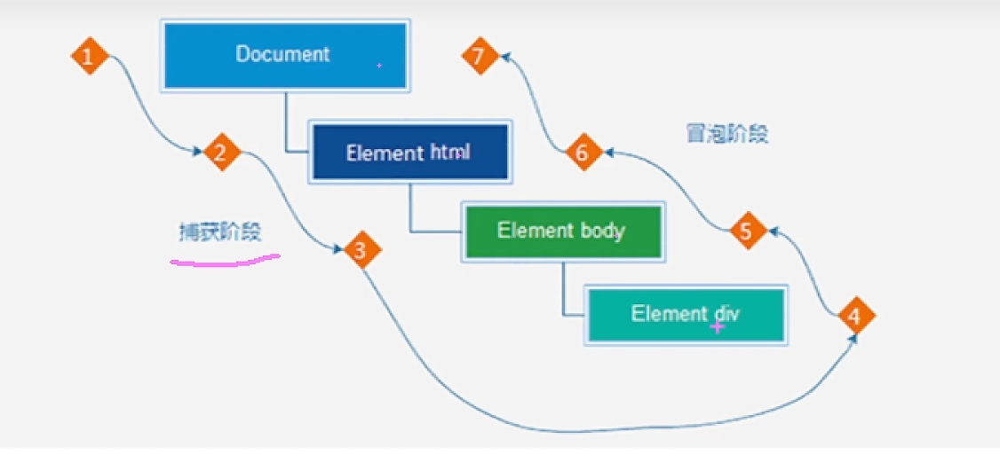

# 事件流

## 一 、事件流

+ 事件流指的是事件完整执行过程中的流动路径

  + 从大到小 捕获
  + 从小到大 冒泡

  

###  事件捕获（了解）

+ 事件捕获概念：

  + 从DOM根元素开始执行对应的时间（从外到里）

+ 事件捕获需要写对应代码才能看到效果

+ 代码

+ ``` js
  DOM.addEventListener(事件类型，事件处理函数，是否使用捕获机制)
  ```

+ 说明

  + addEventListener第三个参数传入true 代表是捕获阶段触发（很少使用）
  + ==若传入false代表冒泡阶段触发，默认是false==

### 事件冒泡

当一个元素事件被触发是，同样的事件会在该元素的所有祖先元素中依次触发。这一过程被称为事件冒泡

+ ==简单理解 ：当一个元素触发后，会依次向上 调用所有父级元素的 同名事件==
+ 事件冒泡是默认存在的
+ L2事件监听第三个参数是 false，或者 默认都是冒泡


### 1.3 阻止冒泡

+ 为了事件不影响父级 要阻止 冒泡事件发生

+ 阻止事件冒泡需要拿到事件对象

+ 语法：

  ``` js
  事件对象.stopPropagation()
  ```

+ ==注意：此方法可以阻断事件流动传播，不光在冒泡阶段有效，捕获阶段也有效==

  ``` js
  fa.addEventListener('click', function () {
    alert('我是爸爸')
  })
  //事件对象里面的方法  e 
  son.addEventListener('click', function (e) {
    alert('我是儿子')
    // 阻止冒泡
    e.stopPropagation()
  })
  
  ```

####  阻止 元素默认行为

+ 某些情况下 需要阻止默认行为的发生，比如 组织链接的跳转，表单域跳转

+ 语法

  ``` js
  e.preventDefault()
  ```

  ``` js
      <form action="http//www.itcast.cn">
          <input type="submit" value="免费注册">
      </form>
      <script>
          const form = document.querySelector('form')
          form.addEventListener('click', function (e) {
              // 阻止默认行为提交
              e.preventDefault()
          })
      </script>
  ```

####   表单重置

``` js
form.reset()
```

#### change事件

+ 内容发生改变才会触发

``` js
        // change事件  内容发生了变化
        const input = document.querySelector('input')
        input.addEventListener('change',function(){
            console.log(111);
        })
```


### 解绑事件

+ L0 事件移除解绑

+ ``` js
  btn.onclick = function () {
    alert('点击了')
  }
  // L0 事假移除解绑
  btn.onclick = null
  ```

+ L2 事件移除解绑

+ 如果使用addEventListener

+  必须使用 removeEventListener 

+ ==匿名函数无法被解绑==

+ ``` js
          function fn() {
              alert('嗲晋级了')
          }
        
          btn.addEventListener('click', fn)
          btn.removeEventListener('click', fn)
  ```

  

####  鼠标经过事件的区别

+ 鼠标经过事件
  + ==mouseover 和mouseout 会有冒泡效果==
  + ==mouseenter 和 mouseleave 没有冒泡效果（推荐）==


## 二、事件委托

+ 事件委托是利用事件流的特征解决 一些开发需求的知识技巧
  + ·优点：减少注册次数，可以提高程序性能
  + ==原理：事件委托其实是利用事件冒泡的特点==
    + 给父元素注册事件，当我们触发子元素的时候，会冒泡到父元素身上，从而触发父元素的事件
  + ==实现：事件对象.target.tagName  可以获得 真正触发事件的元素==


## 三、其他事件

###  页面加载事件

#### load事件

+ 加载外部资源（如图片、外联CSS和javaScript等） 加载完毕时触发的事件

+ 为什么要学？

  + 有些时候需要等页面资源全部处理完了做一些事情

+ 事件名 ： load

+ 监听页面所有资源加载完毕：

  + 给windows 添加load事件

  + ``` js
    //页面加载事件
    window.addEventlistener('load',function(){
    		//执行操作
    })
    ```

  + ``` js
            window.addEventListener('load', function () {
                const btn = document.querySelector('button')
                btn.addEventListener('click', function () {
                    alert(11)
                })
            })
    ```

  + 

+ 注意;不光可以监听整个页面资源加载完毕，也可以针对某个资源绑定load事件

  + ``` js
            // 图片较大 等图片加载完毕 再去执行里面的代码
            img.addEventListener('load',function(){
                
            })
    ```

  

#### DOMContentLoaded事件

+ 当初始的HTMl文档被完全加载和解析完成后，DOMContentLoaded事件被触发，而无需等待样式表、图像等完全加载

+ 事件名：DOMContentLoaded

+ 监听页面DOM加载完毕：

  + 给document 添加 DOMContentLoaded事件

  + ``` js
    document.addEventListener('DOMContentLoaded',function(){
      // 执行的操作
    })
    ```

    

###  页面滚动事件

+ ``` css
  // css 滚动条滚动丝滑  默认auto  不丝滑
  scroll-behavior: smooth;
  ```

+ 滚动条在滚动的时候持续触发的事件

+ 为什么要学？

  + 很多网页需要检测用户把页面滚动到某个区域后做一些处理，比如固定导航栏，比如返回顶部

+ 事件名：scroll

+ 监听整个页面滚动：

+ ``` js
  window.addEventListener('scroll',function(){
    // 执行的操作
  })
  ```

+ 给window 加 或者 给document 添加scroll 事件  常用 window

+ 监听某个元素内部

+ 使用场景；

  + 我们想要页面滚动一段距离，比如 100px， 就让某些元素。。。
  + 显示隐藏，那我们怎么知道，页面滚动了100px呢

+ 可以使用scroll 来检测 滚动的距离

####  页面滚动事件 ——获取位置

+ scrollLeft 和 scrollTop(属性 )

  + 获取被卷去的大小

  + 获取元素内容往左、网上滚出去看不到的距离

  + ==这两个值是可读写的==

       + 可读写的意思  可赋值 可取值
  
  + ==得到的数据 是 数字型 不带 单位的== 
  
  + ``` js
          div.addEventListener('scroll', function () {
                console.log(div.scrollTop);//获取被卷去的头部
            })
    ```
  
+ 开发中 我们经常监测页面滚动的 距离 比如页面滚动100px 就可以显示一个元素  或者固定元素

+ 注意获取 html元素的方式

+ ==获取HTML的写法  document.documentElement==

  ``` js
  const div = document.querySelector('div')
          window.addEventListener('scroll', function () {
              // 获取HTMl的写法  document.documentElement
              // console.log(document.documentElement.scrollTop);
            //一定要写在被滚动事件的 里面
              const n = document.documentElement.scrollTop
              if(n>=100){
                  div.style.display = 'block'
              }else{
                  div.style.display = 'none'
              }
          })
  ```

  

+ 打开页面就滚到 800的地方

  ``` js
          document.documentElement.scrollTop = 800
          window.addEventListener('scroll', function () {
              console.log(document.documentElement.scrollTop);
          })
  ```

  ####  页面滚动事件 ——获取位置

+ scrollT0（）方法可把内容滚到指定的坐标

+ 语法：元素.scrollTop(x,y)

  ```  js
  window.scrollTo(0,1000)
  ```

  

### 页面尺寸事件

#### resize事件

+ 浏览器窗口大小发生变化的时候触发的事件

+ 会在窗口尺寸改变的时候触发

  + resize

  + ``` js
    window.addEventListener('resize',function(){
    //执行代码	
    })
    ```

    

+ 监测屏幕宽度：

+ 获取宽高：==clientWidth和clientHight==

  + ==获取元素的可见部分宽高（不包含边框，margin，滚动条等==）
  
  + ==得到的数据 是 数字型 不带 单位的== 
  
  + ``` JS
            const div = document.querySelector('div')
            console.log(div.clientWidth);
    ```


## 四、元素尺寸与位置

###  offset家族

+ 使用场景：
  + 前面滚动多少距离是我们自己算的，最好是页面滚动到某个元素，就可以做某些事
  + 简单说，就是通过js方式，得带元素在页面中的位置
  + 这样我们可以做，页面滚动到这个位置，就可以做某些操作了，省区计算了
+ 获取宽高：==offsetWidth和offsetHeight==
  + ==获取元素的自身宽度、包含元素自身设置的宽高、padding、border==
  + 获取出来的是数值，方便计算
  + 注意：获取的是可视宽高，如果盒子是隐藏的，获取的结果是0
+ 获取位置：==offsetLeft和offsetTop==       
  + 获取元素距离==自己定位父级元素的左、上距离==
    + offsetLeft和offsetTop 注意是只读属性
  + 如果 父级有定位 以父亲为准  父亲没有 则向上找离自己最近的 祖先元素的定位

###  getBoundingClientRect()

+ 获取位置：

  + element.getBoundingClientRect（）
+ ==方法返回元素的大小及其相对于视口的位置==


总结：

| 属性                      | 作用                                         | 说明                                                      |
| ------------------------- | -------------------------------------------- | --------------------------------------------------------- |
| scroll和scrollTop         | ==被卷去的头部和左侧==                       | 配合页面滚定来用、可读写                                  |
| clientWidth和clientHeight | 获得元素宽度和高度                           | 不包含border，margin，滚动条 用于js获取元素大小，只读属性 |
| offsetWidth和offsetHeight | 获得元素宽度和高度                           | 包含border、padding，滚动条等，只读                       |
| offsetLeft和offsetTop     | ==获取元素距离自己定位父级元素的左、上距离== | 获取元素位置的时候使用，只读属性                          |

