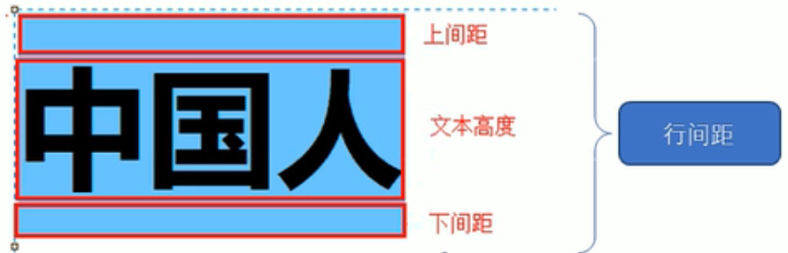

## css层叠样式导读表

### 一、什么是css

1. css是==层叠样式表（Cascading Style Sheets）==的简称,也是一==门标记语言==
2.  css最大的价值 ：==由HTML专注 做结构  样式交个CSS==
3.  css一般==写在 head 标签==中 需要写==一个 style 标签==
4.  ==css主要由两个部分构成 ：选择器和多条声明==
5. 属性和属性值之间用英文 " : " 分开
6.  多个键值对要用 "  ; " 分开

### 二、css基础选择器

>选择器 就是根据不同的需求吧不同的标签选出来 这就是选择器的作用 ==选择标签用的==

#### 1.标签选择器

> 是指用==HTML标签名==作为选择器 将某一类标签全部选择出来
>

#### 2.类选择器

> 单独选择一个或者某几个标签 
>
> ==类选择器口诀：样式点定义，结构类调用，一个或多个, 开发最常用==
>
> 语法 需要用==class属性来调用 class类==的意思  例如：

``` html
<style>
        /* .类名 {
            属性1: 属性值1
            ...
        } */
        .red {
            color: red;
        }
    </style>
</head>
<body>
    <ul>
        <li class="red">冰雨</li>
        <li class="red">来生缘</li>
        <li>李香兰</li>
        <li>江南style</li>
    </ul>
    <div class="red">我也想变红色</div>
</body>
```

##### 类选择器--多类名

> 1. 在标签class属性中写 多个类名
> 2. 多个类名中间必须用空格分开

例如：

```html
<style>
        .red {
            color: red;
        }
        .font35 {
            font-size: 35px;
        }
    </style>
</head>
<body>
    <div class="red font35">刘德华</div>
</body>
```


#### 3.id选择器

> HTML元素以id属性来设置id选择器 ，css中id==选择器以“#” 来定义==。

例如：

``` html
<style>
        /* id选择器的口号:样式#定义,结构id调用,只能调用一次,别人切勿使用 */
        /* 有唯一性 */
        #pink{
            color: pink;
        }
    </style>
</head>
<body>
    <div id="pink">迈克尔·杰克逊</div>
    <div>pink老师</div>
</body>
```


#### 4.通配符选择器

> 通配符选择器==使用"*"定义== ，它表示选取页面中所有的元素（标签）
>
> 这里 把html body div span li 等等都改变了 不需要调用

#### 5.基础选择器总结

| 基础选择器   | 作用                    | 特点                               | 使用情况         |
| ------------ | ----------------------- | ---------------------------------- | ---------------- |
| 标签选择器   | 可以选出所有相同标签    | 不能差异化选择                     | 较多             |
| 类选择器     | 可以选出1个或者多个标签 | 可以根据需求选择                   | 非常多           |
| id选择器     | 一次只能选择1个标签     | id属性只能在每个HTML文档中出现一次 | 一般和js搭配使用 |
| 通配符选择器 | 选择所有标签            | 选择的太多，有部分不需要           | 特殊情况使用     |


### 三、CSS字体属性

##### 3.1 字体系列

> CSS使用 ==font-family==属性 定义文本的字体系列

例如：

``` html
<style>
  h2{
    font-family: '微软雅黑';
  }
  p{
    /* font-family: 'Microsoft YaHei', Arial, Helvetica, sans-serif; */
    font-family: 'Times New Roman', Times, serif;
  }
</style>
```

+ 各个字体间必须使用英文状态下的逗号隔开
+ 一般情况下，如果有空格隔开的的多个字体加引号
+ 尽量使用系统默认自带字体，保证任何用户的浏览器中能正确显示

##### 3.2字体大小

> css使用==font-size==属性定义字体大小

例如：

``` html
 <style>
        body{
            font-size: 16px;
        }
        h2{
            font-size: 16px;
        }
</style>
    <!-- 标题标签比较特殊 需要单独制定文字大小 -->

```

+ px(像素) 大小是我们网页最常用的 单位
+ 谷歌浏览器的默认字体大小为16px
+ 不同浏览器可能默认显示的字号大小不一致，我们尽量给一个明确值大小，不要默认大小
+ ==标题标签比较特殊 需要单独制定文字大小==

##### 3.3字体粗细

> css使用==font-weight==属性设置文本字体的粗细

例如：

``` html
<style>
        .bold{
            /* font-weight: bold; */
          
          
            /* 这个700后面不要加单位  等价于bold 都是加粗的效果  更提倡 数字 */
            font-weight: 700;
        }
        h2{
            font-weight: 400;
            /* font-weight: normal; */
        }
</style>
```

| 属性值  | 描述                                      |
| ------- | ----------------------------------------- |
| normal  | 默认值（不加粗）                          |
| bold    | 定义粗体(加粗的)                          |
| 100-900 | 400==normal  700 == bold 数字后面不跟单位 |

##### 3.4字体样式

> CSS使用==font-style==属性设置文本的风格

| 属性值  | 作用             |
| ------- | ---------------- |
| normal  | 默认值           |
| italic  | 浏览器会显示倾斜 |
| oblique | 也是斜体         |

#### 3.5字体复合属性

> 可以把文字样式综合来写

``` html
<style>
    /* 想要 div 文字变倾斜 加粗 字号设置为 16像素  并且 是微软雅黑 */
    .style{
        font-style: italic;
        font-weight: 700;
        font-size: 16px;
        font-family: 'Microsoft·YaHei';
    }
    .zonghe{
        /* 复合属性：简写的方式  节约代码 */
        /* font: font-style font-weight font-size/line-height font-family; */
        /* 必须按照上面 语法格式顺序 书写，不能更换顺序 并且各个属性以空格隔开 */
        /* font复合属性 必须要有 font-size 和 font-family */
        font: italic 700 16px 'Microsoft yahei';
    }
    </style>
```

### 四、CSS文本属性

#### 4.1文本颜色

> ==color属性==用于定义文本的颜色

| 表示           | 属性值                        |
| -------------- | ----------------------------- |
| 预定义的颜色值 | red ，green，blue             |
| 十六进制       | #fff000，#ff6600              |
| RGB代码        | rgb(255,0,0)或rgb(100%,0%,0%) |

例如：

``` html
<style>
        /* 三种表示颜色的方式 */
        /* 预定义颜色值 */
        /* 十六进制 */
        /* rgb代码 */
        div{
            /* color: deeppink; */
            /* color: #ff0000; */
            color: rgb(200, 0, 0);
        }
    </style>
</head>
<body>
    <div>听说喜欢pink色的男生，都喜欢男人</div>
</body>
```

#### 4.2对齐文本

> ==text-align== 属性用于==设置元素内文本内容==的水平对齐方式

| 属性值 | 解释           |
| ------ | -------------- |
| left   | 左对齐（默认） |
| right  | 右对齐         |
| center | 居中对齐       |

例如：

==想要图片居中对齐，让它的父亲 标签添加水平居中代码==

==h1 块级元素独占一行==

``` html
<style>
        h1{
            /* 本质是让h1盒子里面的文字水平居中对齐 */
            text-align: center;
        }
    </style>
</head>
<body>
    <h1>居中对齐的标题</h1>
</body>
```


#### 4.3 装饰文本

> ==text-decoration==属性规定添加到文本的装饰。可以给==文本添加 下划线、删除线、上划线==等等
>
> ==一般用这个属性来取消a标签的下划线==
>
> ==**可以有多种属性值**== 

| 属性值       | 描述                              |
| ------------ | --------------------------------- |
| none         | 默认                              |
| underline    | 下划线。链接 a 自带下划线（常用） |
| overline     | 上划线。（几乎不用）              |
| line-through | 删除线。（不常用）                |

例如：

``` html
<style>
        div {
            /* text-decoration: underline; 下划线 */
            /* text-decoration: line-through; 删除线 */
            /* text-decoration: overline; 上划线 */
            text-decoration: none;
        }

        a {
            text-decoration: none;
            color: black;
        }
    </style>
</head>

<body>
    <div> <a href="#">huiyi</a> 粉红色回忆 </div>
</body>
```

#### 4.4文本缩进

> ==text-indent属性==用来指定文本的第一行的缩进，通常是将 ==段落的首行进行缩进==


例如：

==em是一个相对单位，就是当前元素（font-size）1个文字的大小==

``` html
<style>
        p{
            font-size: 24px;
            /* 文本的首行缩进多少距离 */
            /* text-indent: 20px; */
            /* 如果此时写了2em，则是当前元素 2个文字（文字不管多大）大小的距离 */
            text-indent: 2em;
        }
    </style>
</head>
<body>
    <p>打开北京、上海与广州的地铁地图，你会看见三张综合交错的线路网络，这代表了中国最成熟的三套成熟轨道
        交通系统</p>
</body>
```


#### 4.5行间距

> ==line-hight属性用于设置行间的距离（行高）==。可以控制文字与行之间的距离
>
> 行间距分为==上间距、文本高度、下间距==。改变行高就是
>
> 

例如：

``` html
<style>
        /* 行间距 包括:上间距，下间距 ，文本高度。 */
        div{
            line-height: 26px;
        }
        p{
            line-height: 25px;
        }
    </style>
</head>
<body>
    <div>中国人</div>
        <p>打开北京、上海与广州的地铁地图，你会看见三张纵横交错的线路网络，这代表了中国最成熟的三套城市轨道交互系统</p>
        <p>可即使这样，在北上广生活的人依然少不了对地铁的抱怨，其中谈及最多的问题便是拥挤--对很多人而言，每次挤地铁的过程，都像是一场硬仗。更何况还是败仗居多</p>
        <p>那么，当越来越多的二线甚至三线城市迎接来了自己的地铁，中国哪里的地铁是最拥挤的?</p>
    </body>
```


#### 4.6元素的文本大小写

 **text-transform** CSS 属性指定如何将元素的文本大写。它可以用于使文本显示为全大写或全小写，也可单独对每一个单词进行操作。 ==主要对单词作用==也可对文字装饰

| 属性值     | 作用                           |
| ---------- | ------------------------------ |
| none       | 阻止所有字符的大小写被转换。   |
| capitalize | 强制每个单词的首字母转换为大写 |
| uppercase  | 强制所有字符被转换为大写       |
| lowercase  | 强制所有字符被转换为小写       |

#### 4.7 英文单词属性

1. 字母间距

   + 可以为正可以为负
   + 适用于汉语

   ``` css
   letter-spacing:2px;
   letter-spacing:-5px;
   ```

2. 单词间距

   + 汉字 或者 单词之间有 空格 才可以用

   ```  css
   word-spacing:4px;
   ```

#### 4.8伪元素改样式

 1. 首字符

    ``` css
    p:first-letter{}
    ```

	2.  首行

     ``` css
     p:first-line{}
     ```

     

#### 4.文本属性总结

| 属性            | 表示                   | 注意点                                                       |
| --------------- | ---------------------- | ------------------------------------------------------------ |
| color           | 文本颜色               | 通常使用十六进制                                             |
| text-align      | 文本对齐               | 可以设定文字水平的对齐方式                                   |
| text-indent     | 文本缩进               | 通常缩进两个字符text-indent ：2em                            |
| text-decoration | 文本修饰               | 主要 添加下划线 underline 取消下划线 none                    |
| line-height     | 行高                   | 控制行与行之间的距离                                         |
| text-transform  | 如何将元素的文本大小写 | 它可以用于使文本显示为全大写或全小写，也可单独对每一个单词进行操作。 |


### 五、CSS的引入方式

> CSS样式表可以分为三大类
>
> 1. ==行内样式表（行内式）==
>
> ``` html
> <body>
>     <p style="color: pink; font-size: 12px;">夏天，夏天，悄悄过去留下小秘密</p>
> </body>
> ```
>
> 2. ==内部样式表（嵌入式）==
>
>   ```html
> <style>
>   div{
>     color: pink;
>   }
> </style>
> </head>
>   <body>
>       <div>所谓内部样式表，就是在html页面内部写样式，但是是单独写到style标签内部</div>
>   </body>
>   ```
>
> 3. ==外部样式表（链接式）==
> 1.  第一步 建css文件 
>    2.  第二步 在html页面中 使用<link>标签引入文件。
>
> ``` html
> <link rel="stylesheet" href="style.css">
> </head>
> <body>
>      <!-- 分两步  第一步 建css文件 -->
>      <!-- 第二步 在html页面中 使用<link>标签引入文件。 -->
>  <div>来啊！快活啊，反正有大把时间。。。</div>
> </body> 
> ```
>
> 

### 六、能够使用调试工具

#### 6.1使用调试工具

1. ==Ctrl + 滚轮 可以放大开发者工具代码大小==
2. 左边HTMl 元素结构 右边是CSS样式结构
3. 右边CSS样式 ==可以改动数值（左右箭头或者直接输入）和产看颜色==
4. ==Ctrl+0 复原浏览器大小==
5. 如果点击元素，发现右侧没有样式引入，极有可能是类名或这引入错误
6. 如果有样式，但是样式前面有==黄色感叹号==，则是样式属性书写错误


