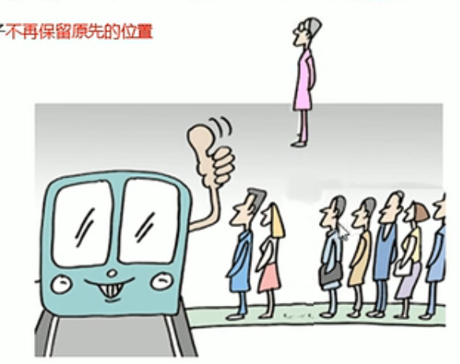
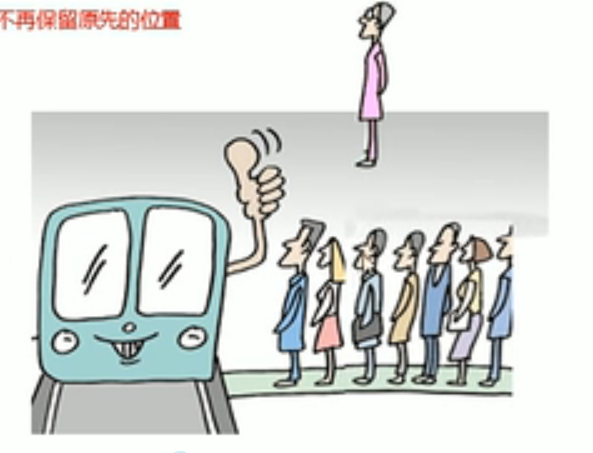
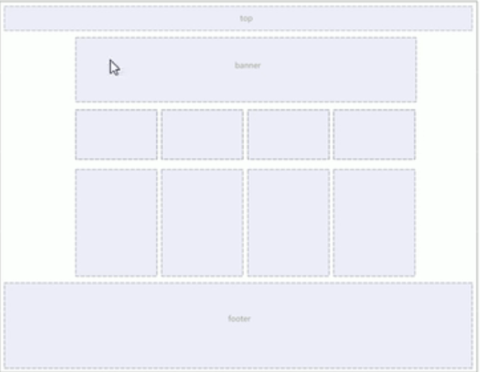
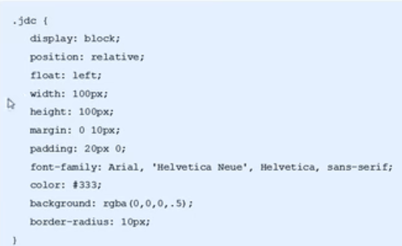

## CSS浮动

#### 一、浮动

#### 1.1传统网页布局的三种方式

网页布局本质————用CSS来摆放盒子。把盒子摆放到相应的位置

CSS提供了三种传统布局方式：

1. ==标准流（按照规定好的方式进行排列）==
   1. 块级元素会独占一行，从上向下顺序排列
      + 常用元素：div  hr p h1~h6 ul ol dl form table
   2. 行内元素会按照顺序，从左到右顺序排列，碰到父元素边缘自动换行、
      + 常用元素：span a i em等
2. 浮动
3. 定位

#### 1.2为什么要用浮动

1. 让块级元素在一行上显示（行内块元素中间有缝隙）
2. 可以改变元素标签默认的排序
3. 浮动产生的最初的目的就是做文字环绕效果的。文字会环绕浮动元素

注意：

==多个块级元素纵向排列找标准流，多个块级元素横向排列找浮动==


#### 1.3什么是浮动

float 属性用于创建浮动框，将其移动到一边，==直到左边缘或右边缘触及包含块 或者 另一个浮动框的边缘==。

语法

``` css
选择器{float:属性值；}
```

| 属性值 | 描述               |
| ------ | ------------------ |
| none   | 元素不浮动（默认） |
| left   | 元素向左浮动       |
| right  | 元素向右浮动       |


#### 1.4浮动特性（重难点）

加了浮动之后的元素，会具有很多特性，需要我们掌握

1. 浮动元素会脱离标准版（脱标）
2. 浮动的盒子==不再保留原先的位置==
3. 如果多个盒子都设置了浮动，==则他们会按照属性值一行内显示并且顶端对齐排列==
4. ==浮动元素是相互紧贴在一起的（不会有缝隙），如果父级宽度装不下这些浮动的盒子，多出的盒子会另起一行对齐。==
5. ==如果行内元素有了浮动则不需要转换块级 添加浮动具有行内块元素特点==
6. ==浮动对于文字、图片、表单元素等内容 浮动元素不会覆盖这些==


#### 1.5浮动元素经常与标准流父级搭配使用

为了约束浮动元素位置，我们一==般布局采取的策略是==：

==先用标准流的父元素排列上下位置，之后内部子元素采取浮动排列左右位置==

​	例子：

``` html
<!DOCTYPE html>
<html lang="en">

<head>
    <meta charset="UTF-8">
    <meta http-equiv="X-UA-Compatible" content="IE=edge">
    <meta name="viewport" content="width=device-width, initial-scale=1.0">
    <title>Document</title>
    <style>
        * {
            margin: 0;
            padding: 0;
        }

        li {
            list-style: none;
        }

        .box {
            width: 1226px;
            height: 615px;
            background-color: pink;
            margin: 0 auto;
        }

        .left {
            float: left;
            width: 234px;
            height: 615px;
            background-color: green;
        }

        .right {
            float: right;
            width: 992px;
            height: 615px;
            background-color: skyblue;
        }

        .right ul li {
            float: left;
            width: 234px;
            height: 300px;
            background-color: #fff;
            margin-left: 14px;
            margin-bottom: 14px;
        }
    </style>
</head>

<body>
    <div class="box">
        <div class="left"></div>
        <div class="right">
            <ul>
                <li>tupian</li>
                <li>tupian</li>
                <li>tupian</li>
                <li>tupian</li>
                <li>tupian</li>
                <li>tupian</li>
                <li>tupian</li>
                <li>tupian</li>
            </ul>
        </div>
    </div>
</body>

</html>
```


#### 1.6浮动注意点

==本质就是浮起来了==

> ==跟排队一样 一个人浮动起来 后面的人会跟上去 但是不能往前飘到人家头上 只能压住后面补上来的人跟下图一样==






==注意点==：

1. 浮动和标准流的父盒子搭配
   + 标准流排列上下位置，之后内部子元素采取浮动排列左右位置
2. 一个元素浮动了，理论上其他的兄弟元素也要浮动
   + 浮动的盒子只会影响==浮动盒子后面的标准流== ==不会影响前面的标准流==

#### 1.7常见网页类型

``` html
<!DOCTYPE html>
<html lang="en">

<head>
    <meta charset="UTF-8">
    <meta http-equiv="X-UA-Compatible" content="IE=edge">
    <meta name="viewport" content="width=device-width, initial-scale=1.0">
    <title>常见网页布局</title>
    <style>
        * {
            margin: 0;
            padding: 0;
        }

        .top {
            height: 50px;
            background-color: gray;
        }

        .banner {
            width: 980px;
            height: 150px;
            background-color: green;
            margin: 10px auto;
        }

        .middle {
            width: 980px;
            height: 150px;
            margin: 0 auto;
            background-color: gray;
        }

        .middle ul li {
            list-style: none;
            float: left;
            width: 237px;
            height: 150px;
            background-color: red;
            margin-right: 10px;
        }

        .middle .middle-last {
            margin: 0
        }

        .box {
            width: 980px;
            height: 300px;
            margin: 0 auto;
            background-color: gray;
            margin-top: 10px;
        }

        .box li {
            list-style: none;
            float: left;
            width: 237px;
            height: 300px;
            background-color: skyblue;
            margin-right: 10px;
        }

        .box .last {
            margin: 0;
        }

        .footer {
            height: 200px;
            background-color: gray;
            margin-top: 10px;
        }
    </style>
</head>

<body>
    <div class="top">

    </div>


    <div class="banner">

    </div>

    <div class="middle">
        <ul>
            <li>1</li>
            <li>2</li>
            <li>3</li>
            <li class="middle-last">4</li>
        </ul>
    </div>


    <div class="box">
        <ul>
            <li>1</li>
            <li>2</li>
            <li>3</li>
            <li class="last">4</li>
        </ul>
    </div>


    <div class="footer">

    </div>
</body>

</html>
```

布局：




### 二、清除浮动

#### 3.1为什么需要清除浮动

由于父级盒子很多情况下，不方便给高度==（让子盒子将父盒子撑开）==，但是子盒子浮动不占用位置，最后父级盒子高度为0，就会影响下面的标准流盒子。 ==当清除浮动 就会让父盒子有 高度== 

+ 由于浮动元素不再占用原文档流的位置，所以它会对后面的元素排版产生影响

#### 3.2清除浮动本质

+ 清除浮动的本质是清除浮动元素造成的影响
+ ==如果父盒子本身有高度，则不需要清除浮动==
+ ==清除浮动之后，父级盒子会根据浮动的子盒子自动检测高度。父级有了高度，就不会影响下面的标准流了==


#### 3.3清除浮动

语法：

``` css
选择器{clear:属性值}
```


| 属性值 | 描述                                       |
| ------ | ------------------------------------------ |
| left   | 不允许左侧有浮动元素（清除左侧浮动的影响） |
| right  | 不允许右侧有浮动元素（清除右侧浮动的影响） |
| both   | 同时清除左右两侧浮动的影响                 |

实际工作中我们只用 clear:both

==清除浮动的策略是：闭合浮动==

#### 3.4清除浮动的方法

1. 额外标签法也称之为隔墙法，是W3C推荐的做法

   + 额外标签法会在浮动元素末尾添加一个空标签（必须是块级元素）。例如==<div style ="clear both"><div>==
     + 优点：通俗易懂，书写方便
     + 缺点：添加许多无意义的标签，结构化比较差

   ``` css
   <style>
           .father {
               width: 100%;
               border: 1px solid red;
           }
   
           .son {
               float: left;
               width: 100px;
               height: 100px;
               background-color: pink;
           }
   
           .erson {
               float: left;
               width: 200px;
               height: 100px;
               background-color: blue;
           }
       </style>
   </head>
   
   <body>
       <div class="father">
           <div class="son"></div>
           <div class="erson"></div>
   				<div style="clear:both"></div>
       </div>
   ```

   

2. 父级添加overflow属性

   可以给父级添加overflow属性，将其属性设置为hidden、auto或scroll

   + 优点：代码简洁

   + 缺点：无法显示溢出的部分

     ``` css
     <style>
             .father {
                 overflow: hidden;
                 width: 100%;
                 border: 1px solid red;
             }
     
             .son {
                 float: left;
                 width: 100px;
                 height: 100px;
                 background-color: pink;
             }
     
             .erson {
                 float: left;
                 width: 200px;
                 height: 100px;
                 background-color: blue;
             }
     
             .three {
                 width: 100%;
                 height: 200px;
                 background-color: black;
             }
         </style>
     </head>
     
     <body>
         <div class="father">
             <div class="son"></div>
             <div class="erson"></div>
         </div>
         <div class="three"></div>
     </body>
     
     ```

     

3. 父级添加————after伪元素

   ​	:after方式是额外标签法的升级版也是给父元素添加相当于在后面添加一个新盒子

   ​	

   + 优点：没有增加标签，结构更简单
   + 缺点：照顾低版本浏览器

   ``` css
   .clearfix:after{
   	content:"";
   	display:block;/*转化为块级元素因为 默认是行内元素*/
   	height:0;
   	clear:both;
   	visibility:hidden;
   }
   .clearfix{
     /*IE6 7专属*/
   	*zoom:1;
   }
   ```

   

4. 父级添加双伪元素

   + 优点：没有增加标签，结构更简单

   + 缺点：照顾低版本浏览器

   ``` css
   .clearfix:before,
   .clearfix:after {
               content: "";
               display: table;
           }
   
           .claerfix:after {
               clear: both;
           }
   
           .clearfix {
               *zoom: 1;
           }
   ```
### 三、CSS属性书写顺序

遵循以下顺序：

1. 布局定位属性：display/position/float/clear/visibility/overflow(建议display第一个写，毕竟关系到模式)
2. 自身属性：width/height/margin/padding/border/background
3. 文本属性：color/font/text-decoration/text-align/vertical-align/white-space/break-word
4. 其他属性（CSS3）：content/cursor/border-radius/box-shadow/text-shadow/backgrond: ...

例如：


### 四、学成在线页面布局

[浮动案例](C:/Users/xiaojingang/Desktop/示例/浮动布局) 

#### 4.1 页面布局整体思路

	为了提高网页制作效率，布局时通常有==以下整体思路==：

1. 必须确定页面的版心（可视区），我们测量可得知
2. 分析页面中的行模块，以及每个行模块中的列模块。是页面的第一准则。
3. 一行中的列模块经常浮动布局，先确定每个列的大小，之后确定列的位置，页面布局第二准则。
4. 制作HTML结构。我们还是遵循，先有结构，后有样式的原则。结构永远最重要
5. 所以先理清==布局结构==，再写代码尤为重要，这需要我们多写多积累
6. 结构永远比样式重要


#### 4.2头部制作

##### nav导航栏注意点：

实际开发中，我们不会直接==使用链接a而是用li 包含a==

1. li+a语义更清晰，一看就是有条理的列表性内容

2. 如果直接用a，搜索引擎容易辨别为有堆砌关键字的嫌疑（故意堆砌关键字容易被搜索引擎有降权的风险）从而影响网站排名

3. 导航栏可以不给宽度，将来可以继续添加其余文字

4. ==因为导航栏里面的文字不一样多，所以最好给链接a左右padding值撑开盒子 而不是指定宽度==

   + ``` css
     .nav ul li a {
         display: block;
         height: 42px;
         padding: 0 10px;
         font-size: 18px;
         line-height: 42px;
         color: #050505;
     }
     ```

##### searh搜索框：

一个search大盒子里面包含两个表单input 和 button

+ button有默认的边框 要去掉
+ input行内块元素 有缝隙 要浮动


#### 4.3 banner制作

+ 1号盒子是通栏的大盒子banner 不给宽度 给高度，给一个蓝色背景
+ 2 号盒子是版心，要水平居中对齐
+ 3号 盒子版心内，左对齐subnav侧导航栏
+ 4号 盒子版心内，右对齐course课程


