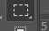

# CSS高级技巧

## 1.精灵图

### 1.1为什么需要精灵图

一个网页中往往会应用很多小的背景图像作为修饰，当网页中的图像过多时，服务器就会频繁的接收和发送请求图片，造成服务器请求压力过大，这将大大降低页面加载速度。

因此，为了有效地减少服务器接受和发送请求的次数，提高页面的加载速度，出现了CSS精灵图技术（也称CSS Sprites 、CSS雪碧）

核心原理：将网页中的一些小背景图片整合到一张大图中，这样服务器只需要一次请求就可以了

### 1.2精灵图（Sprites）的使用

使用精灵图的核心：

1. 精灵技术主要针对背景图片使用，就是把多个小背景图片整合到一张大图中。

2. 移动背景图片位置，此时可以使用background-position。

3. 移动的距离就是这个目标图片的x和y坐标。注意网页中的坐标有所不同

4. 因为一般情况下都是往上移动往左移动，所以数值都是负数

5. 使用精灵图的时候一定要精确测量，每个小背景图片的大小和位置。

6. 使用精灵图的方法ps

   1. 用矩形选框工具

      ​	

   2. 选中精灵图				

   3. 打开窗口里的信息 或者 f8 打开

   4. 鼠标移到选择框的左上角

      

   5. 将width hight 写出来  xy为负值

## 2.字体图标

### 2.1字体图标的产生

字体图标使用场景：主要用于显示网页中通用、常用的一些小图标。

精灵图缺点：

1. 图片文件较大
2. 图片本身放大缩小会失真
3. 一旦图片制作完毕想要更换非常复杂

此时 有一种技术的出现很好的解决了以上的问题，就是字体图标iconfont。

字体图标 ==展示的是图片 本质是字体==

### 2.2字体图标的优点

+ 轻量级：一个图标字体要比一系列的图像要小。一旦字体加载了，图标会立马渲染出来，减少了服务器的请求
+ 灵活性：本质其实是文字，可以很随意的改变颜色、产生阴影、透明效果、旋转等。
+ 兼容性：几乎支持所有浏览器，放心使用

但是 字体图标不能替代精灵技术，只是对工作中图标部分技术的提升和优化


总结：

1. 如果遇到一些结构和样式比较简单的小图标 就用字体图标
2. 如果遇到一些结构和样式比较复杂的小图片 用精灵图

### 2.3.字体图标

字体图标是一些网页常见的小图标，我们直接网上下载即可，因此使用可以分为：

#### 2.3.1. 字体图标的下载

推荐下载网站:

+ ==icomoon字库==

  成立于2011年 推出第一个自定义图标字体生成器，它允许用户选择所需要的图标，使他们成为一字型。

+ 阿里iconfont字库

  这是阿里妈妈M2UX的一个iconfont字体图标字库，可以使用 免费

#### 2.3.2. 字体图标的引用（引入html页面）

1. 把==下载包里面的fonts文件夹放入页面根目录下==

2. 在CSS样式中全局声明字体：简单理解就是把这些字体文件通过css引入到我们页面中 

   ==一定要注意字体文件路径问题==

   将style.css中的一段代码（字体声明代码）复制到目标文件的样式中

   ``` css
   @font-face {
     font-family: 'icomoon';
     src:  url('fonts/icomoon.eot?d3xcsg');
     src:  url('fonts/icomoon.eot?d3xcsg#iefix') format('embedded-opentype'),
       url('fonts/icomoon.ttf?d3xcsg') format('truetype'),
       url('fonts/icomoon.woff?d3xcsg') format('woff'),
       url('fonts/icomoon.svg?d3xcsg#icomoon') format('svg');
     font-weight: normal;
     font-style: normal;
     font-display: block;
   }
   ```

3. 添加小图标

   一般放到span标签里

   

   

4. 给span声明字体样式

   ``` css
   span {
     font-family: 'icomoon';
   }
   ```

   

#### 2.3.3.字体图标的追加（以后添加新的小图标）

如果我们工作中，原来的字体图标不够用了，我们需要添加新的字体图标到原来的字体文件中。

把压缩包里面的 ==selection.json 从新上传==，然后选中自己想要的新图标，从新下载压缩包，并替换原来的文件即可。

## 3.CSS三角

网页中常见一些三角形，使用CSS直接画出来就可以，不必做成图片或者字体图标。

border  设置的都是宽度


做法如下：

``` css
<style>
        .box {
            width: 0;
            height: 0;
            /* border: 10px solid pink; */
            border-top: 10px solid red;
            border-right: 10px solid pink;
            border-bottom: 10px solid blue;
            border-left: 10px solid green;

        }

        .box1 {
            width: 0;
            height: 0;
            /* border: 10px solid pink; */
            border: 10px solid transparent;
            border-right:  pink;

        }
    </style>
</head>

<body>
    <div class="box"></div>
    <div class="box1"></div>

</body>
```

==注意 border 的宽度就是一个三角的高 正方形的高是 border宽度的两倍==

### CSS三角高级应用


让变成 这样的三角


``` css
    <style>
        .box1 {
            width: 0;
            height: 0;
            /* border: 10px solid pink; */
            border-top: 100px solid transparent;
            border-right: 50px solid pink;
            border-bottom: 0px solid blue;
            border-left: 0px solid green;
        }
    </style>
</head>

<body>
    <div class="box1"></div>
</body>
```

==高度是 top设置的 宽度是 right设置的 高度需要 让 bottom变为0  而宽度需要让 left 变成0==


​	


## 4.用户界面样式

所谓用户界面就是更改一些用户操作的样式，以便提高更好的用户体验

+ 更改用户鼠标样式
+ 表单轮廓
+ 防止表单域拖拽

### 4.1 鼠标样式 cursor

``` css
li {cursor:pointer}
```

设置或检索在对象上移动的鼠标指针采用何种系统预定义的光标形状

| 属性值      | 描述      |
| ----------- | --------- |
| default     | 小白 默认 |
| pointer     | 小手      |
| move        | 移动      |
| text        | 文本      |
| not-allowed | 禁止      |

### 4.2 轮廓线 outline

==给表单添加outline：0；或者outline：none样式后，就可以去掉默认的蓝色边框==。

``` css
input{
    outline:none;
}
```

### 4.3 防止拖拽文本域  resize

实际开发中我们文本域右下角是不可以拖拽的

``` css
textarea{
  resize:none;
}
```


## 5.vertical-align 属性应用

CSS的vertical-align属性使用场景：经常==用于设置图片或者表单（行内块元素）和文字的垂直对齐==

官方解释：用于设置一个元素的垂直对齐方式，但是==它只针对行内元素或者行内块元素有效==

语法：

``` css
vertical-align:baseline | top | middle | bottom
```

| 值       | 描述                                   |
| -------- | -------------------------------------- |
| baseline | 默认。元素放置在父元素的基线上         |
| top      | 把元素的顶端与行中最高元素的顶端对齐   |
| middle   | 把此元素放置在父元素的中部             |
| bottom   | 把元素的顶端与行中最低的元素的顶端对齐 |

大多数是让图片和文字 垂直居中

### 5.1 图片底侧空白缝隙解决方法

bug：==图片底侧会有一个空白缝隙，原因是行内块元素会和文字的基线对齐==。

主要解决方法有两种：

1. 给图片添加vertical-align:middle | top | bottom 等。（提倡使用）
2. 把图片转换为块级元素display：block；


## 6.溢出的文字省略号显示

1. 单行文本溢出显示省略号
2. 多行文本溢出显示省略号

### 6.1 单行文本溢出显示省略号--必须满足三个条件

1. 先强制一行内显示文本

   ``` css
   white-space:nowrap;(默认normal 自动换行)
   ```

2. 超出部分隐藏

   ``` css
   overflow:hidden;
   ```

3. 文字用省略号替代超出的部分

   ``` css
   text-overflow:ellipsis;
   ```

### 6.2 多行文本溢出显示省略号

多行文本显示省略号，有较大兼容性问题，适用于webkit浏览器或移动端（移动端大部分是webkit内核）

1. 超出部分隐藏

   ``` css
   overflow:hidden;
   ```

2. 文字用省略号替代超出部分

   ``` css
   text-overflow:ellipsis;
   ```

3. 弹性伸缩盒子模型显示

   ``` css
   display:-webkit-box;
   ```

4. 限制在一个块元素显示的文本的行数

   ``` css
   -webkit-line-clamp:2;
   ```

5. 设置或检索伸缩盒对象的子元素排列方式

   ``` css
   -webkit-box-orient:vertical;
   ```

   ==更推荐让后台人员来做这个效果，因为后台人员可以设置显示多少个字，操作更简单。==


## 7.常见布局技巧

巧妙利用一个技术 更快更好的布局：

### 7.1 magrin 负值运用

+ margin-left:-1px 让右边的边框压住左边的边框 不会变宽
+ 当鼠标 经过时 被挡到的盒子边框显现不出来  让自己的盒子显现出来  加定位或者提高层级

``` css
 <style>
        ul li {
            position: relative;
            float: left;
            list-style: none;
            width: 150px;
            height: 200px;
            border: 1px solid red;
            margin-left: -1px;
        }

        ul li:hover {
            /* 1.如果盒子没有定位，则鼠标经过添加相对定位即可 */
            position: relative;
            border: 1px solid blue;

        }

        ul li:hover {
            /* 2.如果父盒子有定位，则用z-index 提高层级 */
            z-index: 1;
            border: 1px solid blue;

        }
    </style>
</head>

<body>
    <ul>
        <li>1</li>
        <li>2</li>
        <li>3</li>
        <li>4</li>
        <li>5</li>
    </ul>
</body>
```


### 7.2 文字围绕浮动元素

浮动本质 是用来做文字环绕的 不会压住文字 


### 7.3行内块奇妙运用

``` css
<style>
        * {
            padding: 0;
            margin: 0;
        }

        .box {
            text-align: center;
        }

        .box a {
            display: inline-block;
            width: 36px;
            height: 36px;
            background-color: #f7f7f7;
            border: 1px solid #ccc;
            text-decoration: none;
            text-align: center;
            line-height: 36px;
            color: #333;
            font-size: 14px;
        }

        .box .prev,
        .box .next {
            width: 85px;
        }

        .box .current,
        .box .elp {
            background-color: #fff;
            border: none;
        }

        .box input {
            height: 36px;
            width: 45px;
            border: 1px solid #ccc;
            outline: none;
        }

        .box button {
            width: 60px;
            height: 36px;
            background-color: #fff;
            border: 1px solid #ccc;
            /* font-size: ; */
        }
    </style>
</head>

<body>
    <div class="box">
        <a href="#" class="prev"> &lt;&lt上一页</a>
        <a href="#" class="current">2</a>
        <a href="#">3</a>
        <a href="#">4</a>
        <a href="#">5</a>
        <a href="#">6</a>
        <a href="#" class="elp">...</a>
        <a href="#" class="next"> &gt;&gt;下一页 </a>
        到第
        <input type="text">
        页
        <button>确定</button>
    </div>
</body>
```


## 8.CSS 初始化

不同浏览器对有些标签的默认值是不同的，为了消除不同浏览器对HTMl文本呈现的差异，照顾浏览器的兼容，我们需要对CSS初始化

简单理解：CSS初始化是指重设浏览器的样式。也称为CSS reset)

每个网页都必须首先进行CSS 初始化

