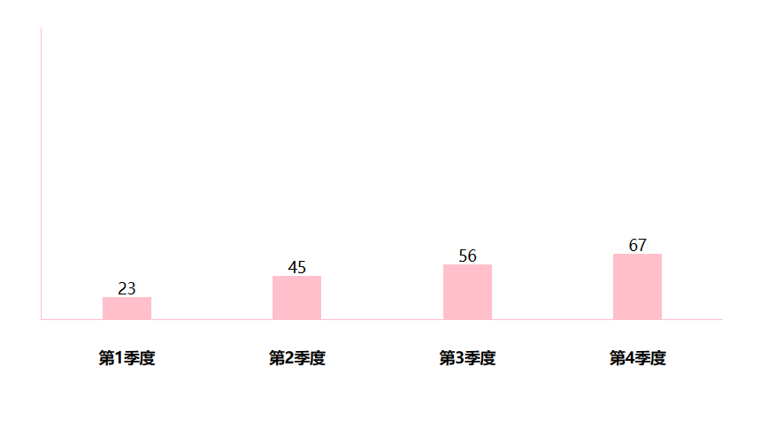

## JavaScript基础第三天

## 一、什么是数组

+ 数组：（Array）是一种可以按顺序保存数据的==数据类型==
+ 为什么要数组？
  + 可以将多个数据可以用数组保存起来，然后放到一个变量中，管理方便
+  每个数组都有自己的编号  都是按顺序保存的
+ 计算机中编号从0开始，所以小明的编号 为0
+ 数据的编号也叫==索引或下标==

## 二、数组的基本使用

+ 1.声明语法

  + 字面量声明数组

  ``` js
  let 数组名 = [数据1，数据2，...,数据n]
  ```

  + 使用 new Array  构造函数声明  到js高级讲

  ``` js
  let arr = new Array(1,2,3)
  ```

+ 2.取值语法

  ``` js
  数组名[下标]
  ```

  取出来是什么类型，就是根据这种类型来访问

+ 3.一些术语

  + 元素：数组中保存的每个数据都叫元素
  + 下标：数组中数据的编号
  + 长度：数组中数据的个数，通过数组的length属性获得

+ **4.遍历数组（重点）**

  用循环把数组中每个元素都访问一边，一般会用for循环遍历

  语法

  ``` js
  for(let i = 0;i < 数组名.length;i++){
  			数组名[i]
  }
  ```

## 操作数组

+ 数组本质是数据集合，操作数据无非就是增删改查与方法


### 3. 数组的查

==数组[下标]==


###  数组的修改

==数组[下标] = 新值==

``` js
   //数组的修改
        let arr = ['pink', 'red', 'green']
        for (let i = 0; i < arr.length; i++) {
            arr[i] = arr[i] + '老师'
        }
        console.log(arr)
```


###  数组添加新的数据

+ ==数组.push() 方法将一个或多个元素添加到数组**末尾**，并返回数组的新长度==（重点）
+ ==arr.unshift(新增的内容)方法将一个或多个元素添加到数组的**开头**，并返回数组的新长度==

语法：

``` js
arr.push(新增的内容)
arr.unshift(新增的内容)
```

例如

``` js
let arr = ['red','green']
arr.push('pink')
console.log(arr)
```

添加数据

```js
       let arr2 = []
        let arr = [2, 0, 6, 1, 77, 0, 52, 0, 25, 7]
        for (i = 0; i < arr.length; i++) {
            if (arr[i] >= 10) {
                arr2.push(arr[i])
            }
        }
        console.log(arr2);
```

###  删除数组中的数据

+ 数组.pop()方法从数组==中删除最后一个元素==，并返回该元素的值

+ 语法

  ``` js
  arr.pop()
  ```

  ``` js
  		    let arr = ['red', 'green', 'blue']
          arr.pop()
          console.log(arr);
  ```

  

+ 数组.shift()方法从数组==中删除第一个元素==，并返回该元素的值

+ 语法

  ``` js
  arr.shift()
  ```

  ``` 
          let arr = ['red', 'green', 'blue']
          arr.shift()
          console.log(arr);
  ```


+ 数组.splice()方法从数组==中删除指定元素==

+ 语法：

+ start 索引号

+ deleteCount：

  + ==可选的。如果不选，就要起始位置删除到最后==

  ``` js
  arr.splice(start,deleteCount)
  arr.splice(起始位置，删除几个元素)
  ```

删除green

``` js
        let arr = ['red', 'green', 'blue']
        arr.splice(1, 1)
        console.log(arr);
```


``` js
    let arr = ['red', 'green', 'blue']
  	 arr.splice(1, 0, 2) *//这个意思 是从下标为2的数据 删除0个 并添加个0* 

    console.log(arr);
```


## 数组中的其他方法( 函数进阶也有 数组的别的方法)

###  数组中map 方法  迭代数组

+ map 也称为映射。映射是个术语，指两个元素的集之间元素相互 ‘对应’ 的关系

+ 使用场景：
  + ==map  可以处理数据，并且返回新的数组==

``` js
        // map 方法 也是遍历  最大的作用处理数据 可以返回一个数组
        const arr = ['red', 'green', 'blue']
        let newArr = arr.map(function (item, index) {
            console.log(item); //item  得到数组元素 red  green  blue
            console.log(index);//index  也就是索引号  0  1   2
            return item + '颜色'
        })
        console.log(newArr); // ['red颜色', 'green颜色', 'blue颜色']

			//体验map方法
        const arr1 = [10, 20, 30]
        let newArr1 = arr1.map(function (item, i) {
            return item + 10
        })
        console.log(newArr1);
```

###  数组中的 join 方法（重点）

+ 作用;

  + join（）方法 用于把数组中的所有元素转换为一个字符串

+ 语法：

  + ``` js
            const arr = ['red', 'green', 'blue']
            // 把数组元素转换为字符串
            console.log(arr.join('-'));
    ```

+ 参数：
  
  + 数组元素是通过参数里面的  指定的分隔符进行分割的


### 数组中的 find 方法

+ ==返回符合测试条件的第一个数组元素值==，如果没有符合条件的则返回undefined

+ 从多个对象中找到符合自己的一条

+ ``` js
             const arr = [
              {
                  name: "小米",
                  price: "1999"
              },
              {
                  name: "华为",
                  price: "1999"
              }
          ]
                
             //let sa = arr.find(function (item) {
               //return item.name === '小米'
             //})
             //console.log(sa);
             
             //箭头函数
          let sa = arr.find(item => item.name === '小米')
          console.log(sa);//{name: '小米', price: '1999'}
  ```


### 数组中reverse 反转

+ 将数组中的 数据反转

+ ``` js
          let arr = ['a', 'b', 'c', 'd']
          arr.reverse() //反转
          console.log(arr);
  ```
  


### ==sort 方法排序==  默认升序

``` js
         //默认升序
        let arr = [2, 4, 5, 1, 3]
        // arr.sort(function (a, b) {
        //     return a - b
        // })
        // console.log(arr);       

			//降序
        arr.sort(function (a, b) {
            return b - a
        })
        console.log(arr);
```


### concat() 方法合并数组

将两个数组合并

``` js
        let arr1 = ['a', 'b', 'c', 'd']
        let arr2 = ['e', 'f', 'g', 'h']
        let newArr = arr1.concat(arr2)
        console.log(newArr);//['a', 'b', 'c', 'd', 'e', 'f', 'g', 'h']
```


### some() 方法 找数组是否有 某个数据

``` js
        // 找数组里面有没有c
        const arr = ['a', 'b', 'c', 'd']
        let res = arr.some(function (item) {//返回值 布尔值， 有一项成立显示true
            return item === 'c'
        })
        console.log(res);
```


### every（） 找每一个元素 是否有 某个数据（重点）

+ 每一个是否都符合条件，如果都符合就返回true 否则返回false

``` js
      //监测是否每一项都大于等10
				const arr = [10, 20, 30, 40]
        let sa = arr.every(item => item >= 10)
        console.log(sa);//true
```


### indexOf  找是否有某个数据 并返回下标

``` js
				const arr = ['a', 'b', 'c', 'd']
        let res = arr.indexOf('c', 3)//从下标 开始找数据 找到返回下标 找不到 返回-1
        console.log(res);
```


### includes 查看是否有 某个数据

``` js
      	const arr = ['a', 'b', 'c', 'd']
        let res = arr.includes('c')//返回布尔值
        console.log(res); //true
```


### 冒泡排序

1. 一共需要的躺数，我们用外层for循环

   + 5个数据我门一共用4趟
   + 长度就是 arr.length -1

2. 每一趟交换次数 我们用 里层for循环

   + 第一趟 交换4次
   + 第二趟 交换3次
   + 第三趟 交换2次
   + 第四趟 交换1次

   + 长度就是 arr.length - 次数
   + 我们的次数是从下标 0 开始的  所以 就是 arr.length - i - 1

3. 交换两个变量

例如

``` js
    <script>
        let arr = [2, 4, 3, 5, 1]
        for (let i = 0; i <= arr.length - 1; i++) {
            for (let j = 0; j <= arr.length - i - 1; j++) {
                if (arr[j] > arr[j + 1]) {
                    let temp = arr[j]
                    arr[j] = arr[j + 1]
                    arr[j + 1] = temp
                }
            }
        }
        console.log(arr);
    </script>
```


### 案例 根据数据生成柱形图

前期html 需要 写在 js里  当学到 dom就不用了

``` css
 <style>
        * {
            padding: 0;
            margin: 0;
        }

        .box {
            display: flex;
            width: 700px;
            height: 300px;
            border-left: 1px solid pink;
            border-bottom: 1px solid pink;
            margin: 50px auto;
            justify-content: space-around;
            align-items: flex-end;
            text-align: center;
        }

        .box>div {
            display: flex;
            width: 50px;
            background-color: pink;
            flex-direction: column;
            justify-content: space-between;
        }

        .box div span {
            margin-top: -20px;
        }

        .box div h4 {
            margin-bottom: -50px;
            width: 70px;
            margin-left: -10px;
        }
    </style>
</head>

<body>

```

``` js
    <script>
        //四次弹窗效果
        // 声明一个新的数组
        let arr = []
        for (let i = 1; i <= 4; i++) {
            let num = +prompt(`请输入第${i}季度的数据：`)
            arr.push(num)
        }
        console.log(arr);
        // 盒子开头
        document.write(`<div class="box">`)
        for (let i = 0; i < arr.length; i++) {
            document.write(`
            <div style="height: ${arr[i]}px;">
            <span>${arr[i]}</span>
            <h4>第${i + 1}季度</h4>
            </div>
            `)
        }
        // 盒子结尾
        document.write(`</div>`)
    </script>
```





