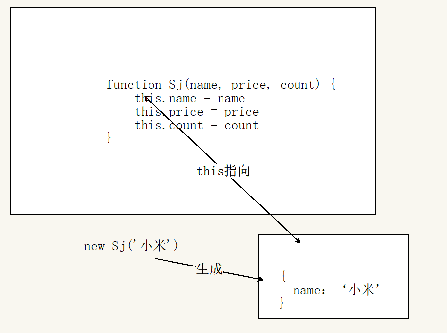
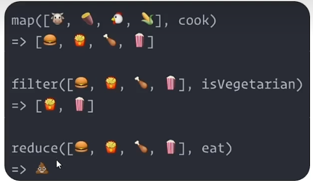
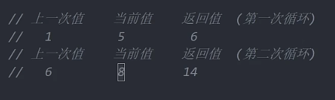
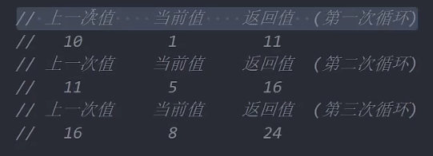

## M端事件（手机事件）

## 深入对象

+ 创建对象的三种方式

### 利用字面量创建对象

``` js
const o = {
		name:'佩奇'
}
```

### 利用new Object 创建对象

``` js
        const obj = new Object()
        obj.uname = 'pink老师'
        // const obj = new Object({ uname: 'pink老师' })
        console.log(obj);
```

### 利用构造函数创建对象

+ **构造函数**：是一种特殊的函数，==主要用来初始化对象  是函数创建对象用的==
+ **使用场景**：常规的{...} 语法允许创建一个对象。比如我们创建了 佩奇的对象，继续创建乔治的对象还要重新写一遍 ，此时可以通过 ==构造函数来 快速创建多个类似的对象== 
+ **将多个公共属性抽出来封装到一起**

**约定：**

1. 它们的命名以大写字母开头
2. 它们只能由“new“ 操作符来执行

#### 构造创建函数语法

+ 跟普通函数相似

``` js
        // 创建一个猪 构造函数
        // uname 和 age 是形参
        function Pig(uname, age) {
            // 相当于 空对象.name = uname
            this.name = uname
            this.age = age
        }
        // 2.new 关键字调用函数
        // 接受创建的对象
        const p = new Pig('佩奇', 6)
        console.log(p);
```

说明：

1. 使用new 关键字调用函数的行为 被称为实例化
2. 实例化构造函数时没有参数时可以省略（） 不提倡省
3. ==构造函数内部无需写return ，返回值即为新创建的对象==
4. 构造函数内部的 return 返回的值无效，==所以不要写return==
5. new Object（） new Date（） 也是实例化构造函数

#### 实例化执行过程

1. 构造函数

2. ==创建新对象 时会自动 生成一个 空的对象   **new的时候才会出现空对象**==   

3. ==构造函数this 指向空的新对象==

4. 执行构造函数代码，修改this，添加新属性

5. 返回新对象

6. 

   


### 实例成员和静态成员

#### 实例成员

+ 实例对象上中的属性和方法

+ ==通过构造函数创建的对象称为实例对象==，==实例对象中的属性和方法称为实例成员==（实例属性和实例方法）

``` js
        // 实例成员 
        function Pig(name) {
            this.name = name
        }
        const peiqi = new Pig('佩奇')
        const qiaozhi = new Pig('乔治')
        peiqi.name = '小猪佩奇' // 实例属性
        peiqi.sayHi = () => { //实例方法
            console.log('hi');
        }
        console.log(peiqi);
        console.log(qiaozhi);
```


#### 静态成员

+ 构造函数上的属性和方法

+ ==构造函数的 属性 和方法被称为 静态成员（静态属性和方法）==

+ 静态成员==只能构造函数来访问==

+ 静态方法中的==this 指向构造函数==

+ ``` js
          // 静态成员
          function Pig(name) {
              this.name = name
          }
          Pig.eyes = 2 //静态属性
          Pig.sayHi = function () { //静态方法
              console.log('hi');
          }
          console.log(Pig.eyes); //2
          console.log(Pig);
  ```

  

## 内置构造函数

在JavaScript 中最主要的 数据类型有 6种

**基本数据类型**

+ 字符串、数值、布尔、undefined、null

**引用类型**

+ 对象

+ 但是我们会发现有些特殊情况：

+ ``` js
  //普通字符串
  const str = 'andy'
  console.log(str.length) //4
  ```

  其实 字符串、数值、布尔、等基本数据类型也有专门的构造函数，这些我们称为包装类型

  ==JS几乎所有的数据 都可以基于构成函数创建==

  ``` js
          // const str = 'pink'
          // 相当于
          const str = new String('pink') // js 底层完成的 把简单数据类型包装为了 引用数据类型
          console.log(str.length);
  ```

  


**引用类型**

+ Object ，Array，RegExp,Date等

**包装类型**

+ String，Number，Boolean等


### Object

Object 是内置的构造函数，用于创建普通对象

``` js
//通过构造函数创建普通对象
const user = new Object（{name:'小明'，age:15}）
```

**Object静态方法**

学习三个常用的静态方法（==只有构造函数Object才可以调用==的）

原来想要获得对象里面的方法和属性

``` js
        let obj = {
            uname: 'andy',
            age: 18,
            sex: '男'
        }
        for (let k in obj) {
            console.log(k);
            console.log(obj.k);
            // 相当于
            // console.log(obj.'uname');  //错误的
            // 相当于 k='uname'
            // 所以只能用 console.log(obj[k]);
            console.log(obj[k]);
        }
```


#### Object 常用三个静态方法


+ **作用**：==Object.keys 静态方法获取对象中所有属性名（键）==

+ **作用**：==Object.values 静态方法中获取对象中所有属性值==

+ 语法：

  + ``` js
            let obj = {
                uname: 'andy',
                age: 18,
                sex: '男'
            }
            //1.获得所有的属性名
            const arr = Object.keys(obj)//返回数组['uname', 'age', 'sex']
            //2.获得所有的属性值
            const arr1 = Object.values(obj)//返回数组['andy', 18, '男']
            console.log(arr)
            console.log(arr1);
    ```

+ ==注意：返回的是一个数组==


+ **作用**：==Object.assign 静态方法常用于对象拷贝== 但是仅仅是浅拷贝可以使用

+ **语法**：

  ``` js
          let obj = {
              uname: 'andy',
              age: 18,
              sex: '男'
          }
          const o = {}
          // 拷贝对象 吧obj拷贝给o
          Object.assign(o, obj)
          console.log(o);//{uname: 'andy', age: 18, sex: '男'}
  ```


+ **使用场景:** 给对象添加属性

+ 例如：

+ ``` js
          let obj = {
              uname: 'andy',
              age: 18,
              sex: '男'
          }
          Object.assign(obj, { height: 200 })
          console.log(obj);//{uname: 'andy', age: 18, sex: '男', height:200}
  ```

  

### Array

+ Array 是内置的构造函数，用于创建数组

+ ``` js
  const arr = new Array(3,5)
  console.log(arr)//[3,5]
  ```


#### 数组中常见实例方法-核心方法

| 方法    | 作用     | 说明                                                         |
| ------- | -------- | ------------------------------------------------------------ |
| forEach | 遍历数组 | 不返回数组，==经常用于查找遍历数组元素==                     |
| filter  | 过滤数组 | 返回新数组，==返回的是筛选满足条件的数组元素==               |
| map     | 迭代数组 | 返回新数组，==返回的是处理之后的数组元素==，想要使用返回的新数组 |
| reduce  | 累计器   | 返回累计处理的结果，常用于求和等                             |




#### reduce

+ reduce执行过程：
  + 如果没有起始值，则==上一次值==以数组的==第一个数组元素的值==
  + 每一次循环，把==返回值给做 下一次循环的上一次值==
  + 如果有起始值，则 ==起始值作为上一次值==

+ 作用：reduce 返回累计处理的结果，经常用于求和等

+ **基本语法**：

+ ``` js
  arr.reduce(function(){},起始值)
  ```

+ ``` js
  arr.reduce(function(上一次值，当前值){},初始值)
  ```

  ``` js
  const arr = [1,2,3,4]
  ```

##### 没有初始值

+ ==循环的次数比 数组的数少一次==

``` js
         	arr.reduce(function(){},起始值)
					// 1.没有初始值
          const arr = [1, 5, 8]
          const total = arr.reduce(function (prev, current) {
            return prev + current
          })
          console.log(total);
```



##### 有初始值

+ ==循环的次数比 数组的数相等==

``` js
				arr.reduce(function(上一次值，当前值){},初始值)
				// 2.有初始值
				const arr = [1, 5, 8]
        const total = arr.reduce(function (prev, current) {
            return prev + current
        }, 10)
        console.log(total);
```



##### 有初始值 的箭头函数

``` js
        // 箭头函数
				const arr = [1, 5, 8]
        const total = arr.reduce((prev, current) => prev + current, 10)
        console.log(total);
```

##### 数组对象的累加

+ ==如果是数组对象的形式 进行累加  一定要写初始值 0==

+ ``` js
          const arr = [
              {
                  name: '张三',
                  salary: 10000
              },
              {
                  name: '李四',
                  salary: 10000
              },
        
              {
                  name: '王五',
                  salary: 10000
              }
          ]
        
          // 计算薪资案例
          const total = arr.reduce((prev, current) => {
              return prev + current.salary
          }, 0)
          console.log(total);
  ```

+ ``` js
          const arr = [
              {
                  name: '张三',
                  salary: 10000
              },
              {
                  name: '李四',
                  salary: 10000
              },
        
              {
                  name: '王五',
                  salary: 10000
              }
          ]
          // 需求 每个人涨薪 30% 当月指出多少薪资
       //const total = arr.reduce((prev, current) => prev + current.salary * 1.3, 0)
          const total = arr.reduce((prev, current) => {
              prev + current.salary * 1.3
          }, 0)
          console.log(total);
  ```


#### 数组中常见实例方法-伪数组转换为真数组

静态方法 Array.from()

+ ==常见的伪数组 document.querySelectorAll==
+ ==arguments 是一个伪数组 只存在于函数中==
+ ==子节点的查找==

``` js
    <ul>
        <li>1</li>
        <li>2</li>
        <li>3</li>
    </ul>
    <script>
        const lis = document.querySelectorAll('ul li')
        // console.log(lis);
        const liss = Array.from(lis)
        // console.log(liss);
        liss.pop()
        console.log(liss);
    </script>
```


### String

+ **常见实例方法**

####  `split('分隔符')`用来将==字符串拆分成数组==(重点)

+ 字符串转数组
+ ==与join 相反 数组转化成字符串==

+ ``` js
  				let str = 'abc, de, fg'
          // let arr = str.split("");
          let arr = str.split(",")//后面跟着分隔字符串的 分隔符
          console.log(arr);
  ```

  

#### ``substring(需要截取的第一个字符的索引[,结束的索引号])``用于字符串截取(重点)

+ 如果结束索引号不写 则默认从 第一个索引截取到最后
+ ==返回值是 截取的新字符串== 
+ 结束索引号可选
+ ==结束的索引号不包含想要截取的部分==

``` js
        let str = '今天开始,又要做核酸了'
        let str1 = str.substring(5, 7) //结束的索引号不包含想要截取的部分
        console.log(str1);
```


#### ``startsWith(检测字符串[，检测位置索引号])``检测是否以某字符开头(重点)

+  如果在字符串的开头找到了给定的字符则返回**`true`**；否则返回**`false`** 
+  在 `str` 中默认从0开始查找 
+ 有索引号时 从索引号开始查找

``` js
        let str = "To be, or not to be, that is the question.";

        console.log(str.startsWith("To be"))         // true
        console.log(str.startsWith("not to be"))     // false
        console.log(str.startsWith("not to be", 10)) // true
```


#### ``includes(搜索的字符串[，检测位置索引号)）``判断一个字符串是否包含在另一个字符串中(重点)

+  如果当前字符串包含被搜寻的字符串，就返回 **`true`**，否则返回 **`false`**。

+ 有索引号时从 索引号开始往后查找 

+ ``` js
  const str = "To be, or not to be, that is the question.";
  
  console.log(str.includes("To be")); // true
  console.log(str.includes("question")); // true
  console.log(str.includes("nonexistent")); // false
  console.log(str.includes("To be", 1)); // false 从o开始往后查找
  console.log(str.includes("TO BE")); // false
  console.log(str.includes("")); // true
  
  ```


####  `toUpperCase`用于将字母转换成大写

+ 语法：

  ``` js
  str.toUpperCase()
  ```

+ 返回值 是 转换为大写的字符串

+ ``` js
          str = 'abcd'
          let str1 = str.toUpperCase()
          console.log(str1); //ABCD
  ```


#### `toLowerCase`用于将就转换成小写

+ 语法:

+ ``` js
  str.toLowerCase()
  ```

+ 返回值 是 转换为小写的字符串

+ ``` js
          str = 'abcd'
          let str1 = str.toUpperCase()
          console.log(str1);//ABCD
          str2 = str1.toLowerCase()
          console.log(str2);//abcd
  ```

  

#### ` indexof`检测是否包含某字符


#### `endswith`检测是否以某字符结尾

+  如果传入的子字符串在搜索字符串的末尾则返回**`true`**；否则将返回 **`false`**。 

+ 作为 `str` 默认从字符串的长度也就是字符串最后开始查找

+ 有索引号时 从索引号开始查找

+ ``` js
          var str = "To be, or not to be, that is the question.";
          console.log(str.endsWith("question."))  // true
          console.log(str.endsWith("to be"))      // false
          console.log(str.endsWith("to be", 19))// true
        
  ```


#### `replace`用于替换字符串，支持正则匹配


#### `match`用于查找字符串，支持正则匹配


####     去除字符串左右的空格

 ``` js
  const str = '  pink '

  console.log(str.trim()); // pink
 ```


### Number 

**实例方法**

#### toFixed（）设置保留小数位的长度

``` js
        // 数值类型
        const num = 10.123
        // 保留两位小数位的长度
        console.log(num.toFixed(2)); //10.12


        // 数值类型
        const num = 10
        // 保留两位小数位的长度
        console.log(num.toFixed(2)); //10.00
```


####  关于小数的计算精度问题

0.1+0.2 = 0.3000000000004

解决方案：我们经常转换为整数

``` js
(0.1*100+0.2*100)/100 === 0.3
```


