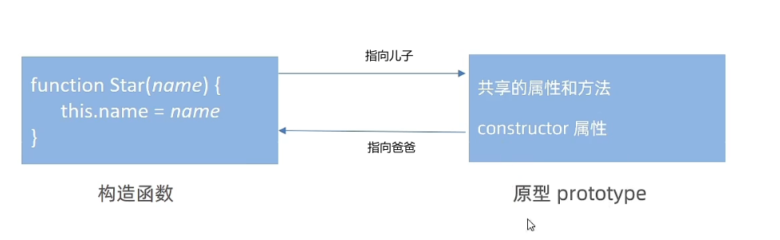
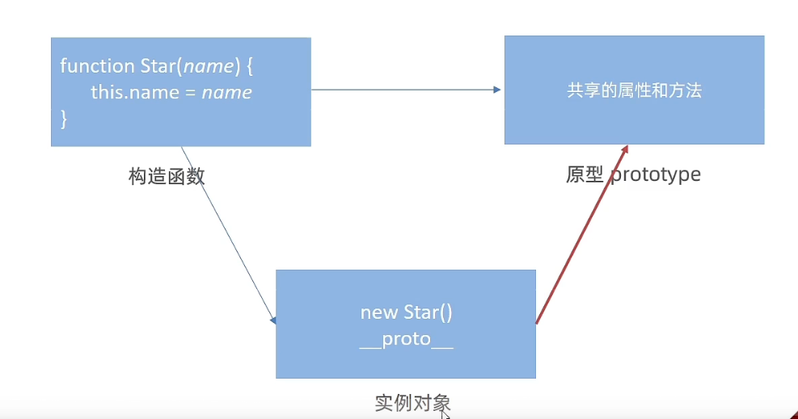
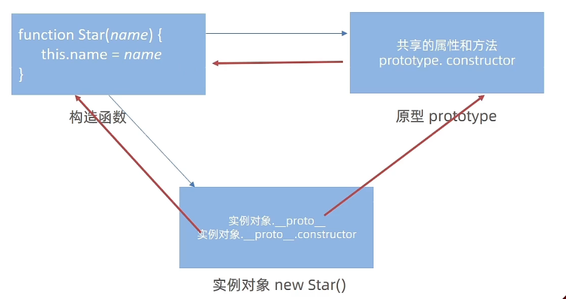
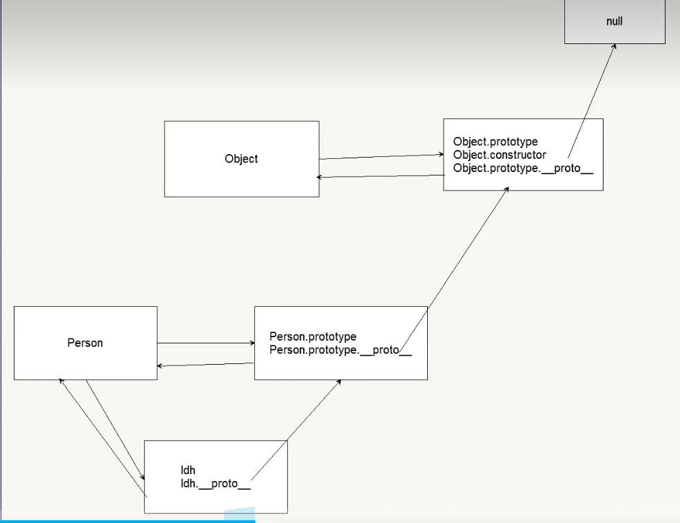
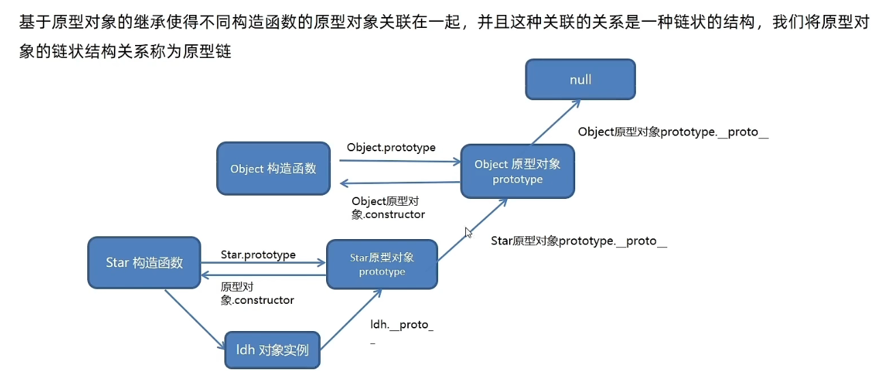

# 深入面向对象

## 编程思想

+ 面向过程
+ 面向对象

### 面向过程编程

+ 优点：性能比面向对象高，适合跟硬件练习很紧密的东西，例如单片机就采用的面向过程编程
+ 缺点：没有面向对象容易维护、易复用、易扩展

+ ==面向过程==就是分析问题所需要的步骤，然后==用函数把这些步骤一步一步实现==，使用的时候再==一个一个的依次调用==就可以了
+ **举个例子：蛋炒饭**

### 面向对象编程（oop）

+ ==面向对象==是把事务==分解成为一个一个对象==，然后由==对象之间分工合作==
+ **举个例子：盖浇饭**
+ 面向对象是以功能来划分的 而不是步骤


+ ==在面向对象程序开发思想中，每一个对象都是功能中心，具有明确分工==
+ 面向对象编程具有灵活性，代码可复用、容易维护和开发的优点，更适合多人合作的大型软件项目
+ **面向对象的特性：**
  + 封装性
  + 继承性
  + 多态性

+ 优点：容易维护、易复用、易扩展 由于面向对象具有封装、继承、多态性的特点，可以设计出低耦合的系统，使得系统更加灵活、更加易于维护
+ 缺点：性能低


## 构造函数

+ js 面向对像 需要借助构造函数

+ 前面我们学过的构造函数方法很好用，但是存在浪费内存问题


``` js
        // 构造函数  公共的属性和方法 封装到Star  构造函数里面了
        function Star(uname, age) {
            this.uname = uname
            this.age = age
            this.sing = function () {
                console.log('唱歌');
            }
        }
        let ldh = new Star('刘德华', 55)
        let zsy = new Star('张学友', 58)
        console.log(ldh.sing());
        console.log(ldh.sing === zsy.sing); //结果是 false 因为两次存入的 地址不同 造成内存浪费
```


## 原型

+ 构造函数通过原型分配的函数是所有对象所共享的
+ JavaScript规定，==每一个构造函数都有一个prototype 属性==，指向另一个对象，所以我们==也称为原型对象==
+ 这个对象可以挂载函数，对象实例化不会多次创建原型上函数，节约内存
+ ==我们可以直接把那些不变的方法，直接定义在prototype 对象上==，这样所有对象的实例就可以==共享这些方法==
+ 构造函数和原型对象中的this 都指向 实例化对象

``` js
        // 构造函数  公共的属性和方法 封装到Star  构造函数里面了
        // 1.公共的属性写到 狗仔函数里面
        function Star(uname, age) {
            this.uname = uname
            this.age = age
        }
        // 2.公共的方法写到原型对象里面
        Star.prototype.sing = function () {
            console.log('唱歌');
        }
        let ldh = new Star('刘德华', 55)
        let zxy = new Star('张学友', 58)
        ldh.sing()
        zxy.sing()
        console.log(ldh.sing === zxy.sing); //结果是true  说明sing（） 可以共享
```


+ 构造函数和原型对象中的this 都指向 实例化对象、

  ``` js
          let that
          function Star(uname) {
              // that = this
              this.uname = uname
          }
          // 原型对象 里面的函数 this 指向的还是 实例对象 
          Star.prototype.sing = function () {
              that = this
              console.log('唱歌');
          }
          // 构造函数里面的 this 就是指向 实例对象
          const ldh = new Star('ldh')
          const zxy = new Star('zxy')
          ldh.sing()
          console.log(that === ldh); //true
          console.log(that);
  ```


+ ``` js
          // 自己定义 数组扩展方法 求和 和最大值
          // 1.我们定义的这个方法，任何一个数组的实例对象都可以使用
          // 2.自定义的方法 写到原型身上 数组.prototype 身上
          // 1，最大值
          const arr = [1, 2, 3]
          Array.prototype.max = function () {
              // 展开运算符
              return Math.max(...this)//this 指向 实例对象 被调用的 数组
          }
          console.log(arr.max());
        
          // 2.最小值
          Array.prototype.min = function () {
              // 展开运算符
              return Math.min(...this)//this 指向 实例对象 被调用的 数组
          }
          console.log(arr.min());
        
          // 3.求和 数组      reduce 方法过与困难
          Array.prototype.sum = function () {
              return this.reduce((prev, item) => prev + item, 0)
        
          }
          console.log(arr.sum());
  ```


### constructor（构造函数）属性

+ 每个原型对象都有 constructor属性 
+ 作用：该属性指向==该原型对象的 构造函数==，简单理解==就是指向我的爸爸，我是有爸爸的孩子==



``` js
        // constructor 单词 构造函数
        function Star() {

        }
        const ldh = new Star
        console.log(Star.prototype.constructor === Star); //true
```


+ 当一个一个 通过给原型对象添加 函数  时过于麻烦时

  + 必须重新指回对象  否则相当于一个 普通对象来使用
  + 重新指回 创造这个原型对象的  构造函数

+ ``` js
          // constructor 单词 构造函数
          function Star() {
        
          }
        				//   过于麻烦
          //    Star.prototype.sing = function(){
          //     console.log('唱歌');
          //    }
          //    Star.prototype.dance = function(){
          //     console.log('跳舞');
          //    }
          console.log(Star.prototype);
          Star.prototype = {
              // 重新指回 创造这个原型对象的  构造函数
              constructor: Star, //必须重新指回对象  否则相当于一个 普通对象来使用
              sing: function () {
                  console.log('唱歌');
              },
              dance: function () {
                  console.log('跳舞');
              },
          }
          console.log(Star.prototype);
  ```

+ 


## 对象原型

+ 对象都会有一个属性  __ proto __ 指向构造函数的prototype原型对象，之所以我们对象可以使用构造函数 prototype原型对象的属性和方法 是以为 对象有 __  proto __ 原型存在
+ 


+ _  proto _ 是JS 非标准属性
+ [[prototype]]和__ proto __ 意义相同
+ 用来表明当前==实例对象指向那个原型对象 prototype==
+ __ proto __ 对象原型里面也有一个constructor属性，==指向创建该实例对象的构造函数==


+ ==我感觉 prototype 是构造函数的 里面的 其中一个对象  而 实例对象里面的没有prototype 当实例对象需要用到prototype里面的 公共方法时 需要用 __ proto __指向 prototype==

+ 再理解就是 prototype  是构造函数 里面的 属性或者是类的一种 用于存储 公共的方法 
+ 而 __ proto __ 是实例对象的 属性 就是用来指向Star 里面的 prototype的  




## 原型继承

继承也是面向对象的 一个特征

+ 子类的原型等于 = new 父类
+ 必须用 constructor指回原来的 构造函数

``` js
        // 继续抽取封装   公共的部分放到原型上 
        const Person = function () {
            this.eyes = 2
            this.head = 1
        }
        // 女人 构造函数
        function Woman() {
            this.baby = 1
        }
        // 通过原型继承来继承 Person
        // 父构造函数（父类） 子构造函数（子类）
        // 子类的原型等于 = new 父类
        Woman.prototype = new Person
        // 指回原来的构造函数
        Woman.prototype.constructor = Woman

        Woman.prototype.baby = function () {
            console.log('baby');
        }

        const red = new Woman()
        console.log(red);
        // 男人构造函数
        function Man() {

        }
        Man.prototype = new Person
        // 指回原来的 构造函数
        Man.prototype.constructor = Man
        const pink = new Man()
        console.log(pink)
```


## 原型链

+ 基于原型对象的继承使得不同构造函数的原型对象关联在一起，并且这种关联的关系是一种链壮的结构，我们将原型对象的链状结构关系称为原型链
+ ==只要是对象就有 __ proto __==
+ ==只要是原型对象就有 constructor==

``` js
        // Object 是最大的
        console.log(Object.prototype.__proto__);//null
        function Person() {

        }
        const ldh = new Person()
        console.log(Person.prototype.__proto__ === Object.prototype);
```







#### 原型链查找规则

+ 当访问一个对象的属性（包括方法）时，==首先==查找这个==对象自身==有没有该属性。
+ 如果没有就查找它的原型（也就是``__ proto __``指向的`prototype`原型对象)
+ 如果还没有就查找原型对象的原型( ==Object的原型对象==)
+ 依此类推一直找到Object为止（ null )
+ __ proto ___对象原型的==意义就在于为对象成员查找机制提供一个方向，或者说一条路线==
+ 可以使用`` instanceof`` 运算符用于检测构造函数的prototype属性是否出现在某个实例对象的原型链上

``` js
        // Object 是最大的
        console.log(Object.prototype.__proto__);//null
        function Person() {

        }
        const ldh = new Person()
        console.log(Person.prototype.__proto__ === Object.prototype);
        console.log(ldh instanceof Person); //true
        console.log(ldh instanceof Object); //true
        console.log(Person.prototype instanceof Object); //true
        console.log(Array instanceof Object);//数组也属于对象 万物皆对象
```


