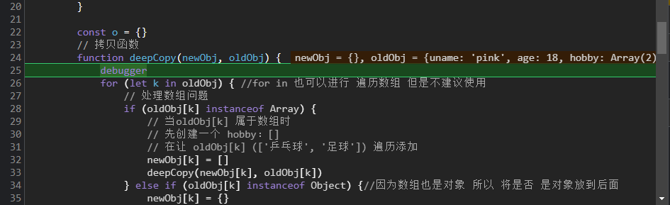
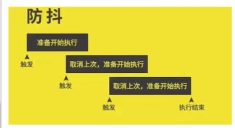
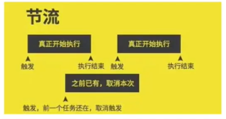

#  高阶技巧

## 深浅拷贝

+ 直接赋值 赋值给的是地址 会把 原来堆里面的东西也进行更改

### 浅拷贝

+ ==简单数据类型的拷贝没问题  引用数据类型  拷贝的是地址 还是有问题==

+ 单层没问题  多层有问题

  **常见方法**

  1. 拷贝对象：==Object.assgin()==  或者  ==展开运算符 {...obj} 拷贝对象==
  2. 拷贝数组：Array.prototype.concat()  或者 [...arr]

``` js
        const obj = {
            uname: 'pink',
            age: 18,
            
        }
        // 浅拷贝
        // const o = { ...obj }
        // console.log(o);
        // o.age = 20
        // console.log(o);
        // console.log(obj);

        const o = {}
        Object.assign(o, obj)
        o.age = 20
        console.log(o);
        console.log(obj);
```


### 深拷贝

常见方式

1. 通过函数递归的方式实现深拷贝
2. lodash/cloneDeep
3. 通过JSON.stringify() 实现


#### 递归实现深拷贝

**函数递归**

如果一个函数在内部可以调用其本身，那么这个函数就是递归函数

+ 简单理解：函数内部自己调用自己，这个函数就是递归函数
+ 递归函数的作用和循环效果类似
+ 由于递归很容易发生 “栈溢出” 错误 ，所以必须要加退出条件 return 

``` js
        let i = 1
        function fn() {
            console.log(`这是第${i}次`);
            if (i >= 6) {
                return //如果不return  会栈溢出 会卡死
            }
            i++
            fn()
        }
        fn()
```


+ **利用setTimeout 模拟 setInterval**

+ ``` js
  function getTime(){
    document.querySelector('div').innerHTML = new Date().toLocaleString()
    setTimeout(getTime,1000)
  }
  getTime()
  ```

  

**利用递归函数 实现深拷贝（简版）**

+ 浅拷贝 需要在 浅拷贝上加工

``` js
        const obj = {
            uname: 'pink',
            age: 18,

        }
        const o = {}
        // 拷贝函数
        function deepCopy(newObj, oldObj) {
            for (let k in oldObj) {
                newObj[k] = oldObj[k]
            }
        }
        deepCopy(o, obj)//函数调用 两个参数 o 新对象 obj 旧对象
        console.log(o);
        o.age = 20
        console.log(obj);
```

+ 深拷贝 

+ ``` js
      	const obj = {
                  uname: 'pink',
                  age: 18,
                  hobby: ['乒乓球', '足球'],
                  family: {
                      baby: '小pink'
                  }
              }
    
              const o = {}
              // 拷贝函数
              function deepCopy(newObj, oldObj) {
                  debugger
                  for (let k in oldObj) { //for in 也可以进行 遍历数组 但是不建议使用
                      // 处理数组问题
                      if (oldObj[k] instanceof Array) {
                          // 当oldObj[k] 属于数组时
                          // 先创建一个 hobby：[]
                          // 在让 oldObj[k] (['乒乓球', '足球']) 遍历添加
                          newObj[k] = []
                          deepCopy(newObj[k], oldObj[k])
                      } else if (oldObj[k] instanceof Object) {//因为数组也是对象 所以 将是否 是对象放到后面
                          newObj[k] = {}
                          deepCopy(newObj[k], oldObj[k])
                      } else {
                          newObj[k] = oldObj[k]
                      }
      
                  }
              }
              deepCopy(o, obj)//函数调用 两个参数 o 新对象 obj 旧对象
              console.log(o);
              o.age = 20
              o.hobby[0] = '篮球'
              o.family.baby = '老pink'
              console.log(obj);      
   ```

  ```js

          const arr = [1, 2, 3]
          for (let k in arr) {
              console.log(k); // 0 1  2 字符串
          }
  ```

+ ==面试：做过深拷贝吗 深拷贝是如何实现的==
1. 深拷贝 是拷贝出来的新对象不会影响 旧对象 要想实现深拷贝需要用到函数递归
  2. 如果是普通拷贝 直接赋值就行 但是如果遇到数组 再次调用递归函数
  3. 如果遇到 对象 再次 调用递归
  4. 先数组 后对象


#### js库lodash 里面cloneDeep内部实现深拷贝

+ 引入库 ladash里面的 深拷贝

``` js
    <script src="./lodash.min.js"></script>
    <script>
        const obj = {
            uname: 'pink',
            age: 18,
            hobby: ['乒乓球', '足球'],
            family: {
                baby: '小pink'
            }
        }
        const o = _.cloneDeep(obj)
        o.hobby[0] = '足球'
        o.family.baby = '老pink'
        console.log(o);
```


#### 利用JSON 实现深拷贝

``` js
        const obj = {
            uname: 'pink',
            age: 18,
            hobby: ['乒乓球', '足球'],
            family: {
                baby: '小pink'
            }
        }
        // 把对象转换为 JSON字符串
        JSON.stringify(obj)
        // 把字符串转换成对象
        JSON.parse(JSON.stringify(obj))
        const o = JSON.parse(JSON.stringify(obj))
        o.hobby[0] = '足球'
        o.family.baby = '老pink'
        console.log(o);
        console.log(obj);
```


## 异常处理

### throw 抛异常

异常处理是指预估代码执行过程中可能发生的错误，然后最大程度的避免错误的发生导致整个程序无法继续运行

``` js
        function fn(x, y) {
            if (!x || !y) {
                // throw '没有参数传递进来'  //会中断
                throw new Error('没有参数传递进来')
            }
            return x + y
        }
        fn()
```

总结：

1. ==throw 抛出异常信息，程序也会终止执行==

2. throw 后面跟的是错误提示信息

3. Error 对象配合throw 使用，能够设置更详细的 错误信息

   

### try / catch 捕获错误信息

我们可以通过try/catch 捕获错误信息（浏览器提供的错误信息） try 试试 catch 拦住 finally 最后

``` js
        function fn() {
            try {
                // 可能发生错误的代码 ，要写到try
                const p = document.querySelector('。p')
                p.style.color = 'red'
            } catch (err) {
                // 拦截错误 提示浏览器提供的错误信息，但是不中断程序的执行
                console.log(err.message);
                throw new Error('你看看,选择器错误了把')
                return //需要加return 中断程序
            }
            finally {
                // 不管程序对不对一定会执行的代码
                alert('弹出对话框')
            }
            console.log(11);
        }
        fn()
```


总结：

1. try...catch 用于捕获错误信息
2. ==将预估可能发生错误的代码写在try代码段中==
3. ==如果try 代码断中出现错误后，会执行catch代码段，并截获到错误信息== 需要加return 中断程序
4. ==finally 不管是否有错误，都会执行==


### debugger

+ 用于程序的调试 类似于断点

``` js
        // 拷贝函数
        function deepCopy(newObj, oldObj) {
            debugger
            for (let k in oldObj) { //for in 也可以进行 遍历数组 但是不建议使用
                // 处理数组问题
                if (oldObj[k] instanceof Array) {
                    // 当oldObj[k] 属于数组时
                    // 先创建一个 hobby：[]
                    // 在让 oldObj[k] (['乒乓球', '足球']) 遍历添加
                    newObj[k] = []
                    deepCopy(newObj[k], oldObj[k])
                } else if (oldObj[k] instanceof Object) {//因为数组也是对象 所以 将是否 是对象放到后面
                    newObj[k] = {}
                    deepCopy(newObj[k], oldObj[k])
                } else {
                    newObj[k] = oldObj[k]
                }

            }
        }
```

当页面刷新时 会自动跳出




## 处理this

### this 指向

+ 对象里面没有this

#### 普通this指向

+ 普通函数的调用方式决定this 的值，即【谁调用this 的值指向谁】

+ ``` js
          console.log(this);//window
          function fn() {
              console.log(this); //window
          }
          fn()
          setTimeout(function () {
              console.log(this);//window
          }, 1000)
  ```

+ 

+ ``普通函数``没有明确调用者时 this 值为 window ，严格模式下 没有调用者时 this 的值为 undefined

+ 严格模式：        'use strict'

``` js
        'use strict' //开启严格模式

        console.log(this);//window
        function fn() {
            console.log(this); //undefined
        }
        fn()
        setTimeout(function () {
            console.log(this);//window
        }, 1000)
```


``` js
// 普通函数 谁调用我 ，this就指向谁
        // 'use strict'
        console.log(this);//window
        function fn() {
            console.log(this); //window
        }
        fn()
        setTimeout(function () {
            console.log(this);//window
        }, 1000)
        document.querySelector('button').addEventListener('click', function () {
            console.log(this); //指向button 
        })
        const obj = {
            sayHi: function () {
                console.log(this); //指向obj
            }
        }
        obj.sayHi()
```


#### 箭头函数this指向

注意情况1：

+ 在开发中【使用箭头函数前需要考虑函数中this的值】，事件回调函数使用箭头函数时，this 为全局的 window 因此在DOM事件回调函数如果里面需要DOM对象的this 则不推荐使用箭头函数

``` js
     const btn = document.querySelector('.btn')
        // 箭头函数 
        btn.addEventListener('click', () => {
            console.log(this);//window
        })
        //普通函数
        btn.addEventListener('click', function () {
            console.log(this); //指向btn
        })
```

注意情况2：

+ 同样由于箭头函数this的原因，基于原型的面向对象也不推荐采用箭头函数

+ ``` js
       function Person() {
    
          }
          // 原型对象上添加了箭头函数
          Person.prototype.walk = () => {
              console.log('人都要走路。。。');
              console.log(this);//window  不指向实例对象了 没法添加了
          }
          const p1 = new Person()
          p1.walk()
  ```


总结：

1. 函数内不存在this ，沿用上级的
2. 不适用
   + 构造函数，原型函数，dom事件函数等等
3. 适用
   + 需要使用上层this的地方
4. 使用正确的话，它会在很多地方带来方便，后面我们会大量使用


### 改变this

JavaScript 中还允许指定函数中this 的指向，有3个方法可以动态指定普通函数中this的指向

+ call（）
+ apply（）
+ bind（）

#### 1.call（）-了解

+ 使用call 方法调用函数，同时指定被调用函数中得this值

+ 语法

+ ``` js
  fun.call(thisArg,arg1,arg2,...)
  ```

  + thisArg:在fun 函数运行时指定的this值
  + arg1，arg2：传递的其他参数
  + ==返回值就是函数的返回值，因为它就是调用函数==

``` js
      const obj = {
            uname: 'pink'
        }
        function fn(x, y) {
            console.log(this);//obj
            console.log(x + y); //3
        }
        // 1.调用函数
        // 2.改变this 指向
        fn.call(obj, 1, 2)
```


#### apply（）-理解

+ 使用apply 方法调用函数，同时指定被调用函数中的this值

+ 语法：

+ ``` js
  fun.apply(thisArg,[argsArray])
  ```

  + thisArg:在fun函数运行时指定的this值
  + ==argsArray：传递的值，必须包含在数组里面==
  + 返回值就是函数的返回值，因为它就是调用函数
  + ==因此apply 主要跟数组有关系，比如使用Math.max() 求数组的最大值==

``` js
        const obj = {
            age: 18
        }
        function fn(x, y) {
            console.log(this);
            console.log(x, y);
        }
        // 1.调用函数
        // 2.改变this 指向
        fn.apply(obj, [1, 2])
        // 3.返回值，本身就是在调用函数，所以返回值就是函数的返回值

        // 使用场景 ：求数组最大值
        const arr = [100, 44, 77]
        const max = Math.max.apply(Math, arr)
        console.log(max);
        console.log(Math.max(...arr));
```


#### bind() -重点

+ ==bind()方法不会调用函数==。但是能改变函数内部this指向

+ 语法：

  ``` js
  fun.bind(thisArg,arg1,arg2,...)
  ```

  + thisArg:在fun函数运行时指定的this值
  
  + arg1，arg2：传递的其他参数
  
  + ==返回==有指定的this值和初始化参数改造的 ==原函数拷贝 （新函数）== 相当于返回值是个函数 里面的 this 值是更改过的
  
    ```js
            const obj = {
                age: 18
            }
            function fn() {
                console.log(this);
            }
    
            //function fn() {
            //    console.log(this);// 这是相当于拷贝的一份函数 指向 obj
            //}
            // 当加了bind 改变指向时 相当于与吧fn  拷贝一份  而 里面的 this 值 指向obj
            const fun = fn.bind(obj)
            fun()
    ```
  
    
  
  + 因此我们指向改变this 指向，并且不想调用这个函数的时候，可以使用bind，比如改变定时器内部的this指向

``` js

        const btn = document.querySelector('button')
        btn.addEventListener('click', function () {
            this.disabled = true
            window.setTimeout(function () {
                // 在这个普通函数里面，我们要this 有原来的window 指向btn
                this.disabled = false
            }.bind(this), 2000)
        })
```


**总结**

+ 相同点
  + 都可以改变函数内部的this指向
+ 区别点
  + call 和apply 会调用函数 并且改变函数内部this 指向
  + call 和apply 传递的参数不一样，call传递参数aru1,aru2... 形式 apply 必须数组形式[arg]
  + ==bind 不会调用函数，可以改变 函数内部this指向==
+ 主要应用场景：
  + call调用函数并且可以传递参数
  + apply 经常与数组有关系，比如借助数学对象实现数组最大值，最小值
  + ==bind 不调用函数，但是还想改变 this指向，比如改变 定时器内部的this指向==


## 防抖(debounce)

+ 防抖：==单位时间内 频繁触发事件 只执行最后一次==
+ 就像回城 打断了就重新来
+ 使用场景
  + 搜索框搜索输入。只需要用户最后一次输入完，在发送请求
  + 手机号、邮箱验证输入检测


### lodash 防抖

语法

``` js
_.debounce(func, [wait=0], [options=])
```


+ 创建一个 debounced（防抖动）函数，该函数会从上一次被调用后，延迟 `wait` 毫秒后调用 `func` 方法 

``` js
  <script src="./lodash.min.js"></script>
<style>
    .box {
      width: 500px;
      height: 500px;
      background-color: #ccc;
      color: #fff;
      text-align: center;
      font-size: 100px;
    }
  </style>
</head>

<body>
  <div class="box"></div>
  <script src="./lodash.min.js"></script>
  <script>
    // 利用防抖实现性能优化
    // 需求：鼠标在盒子上移动，里面的数字会发生变化 + 1
    const box = document.querySelector('.box')
    let i = 1
    function mouseMove() {
      box.innerHTML = i++
      // 如果里面存在大量消耗性能的代码，比如dom操作 比如数据处理 可能造成卡顿
    }
    // 利用ladash 库实现防抖 - 500 毫秒之后采取+1
    box.addEventListener('mousemove', _.debounce(mouseMove, 100))
```


### 手写防抖函数

核心思路：

防抖的核心是利用定时器（setTimeout）来实现

+ 声明一个定时器变量，

+ 每次鼠标滑动都先判断是否有定时器了，如果有定时器先清除以前的定时器

+ 如果没有定时器则开启定时器，记得存到变量里面

+ 在定时器里面调用要执行的函数

+ ``` js
      // 利用防抖实现性能优化
      // 需求：鼠标在盒子上移动，里面的数字会发生变化 + 1
      const box = document.querySelector('.box')
      let i = 1
      function mouseMove() {
        box.innerHTML = i++
        // 如果里面存在大量消耗性能的代码，比如dom操作 比如数据处理 可能造成卡顿
      }
      // 利用ladash 库实现防抖 - 500 毫秒之后采取+1
      // box.addEventListener('mousemove', _.debounce(mouseMove, 100))
  
      // 手写防抖函数
      // 核心是利用 setTimeout 定时器来实现的
      // 1.声明定时器变量
      // 2.每次鼠标移动 （时间触发） 都要判断是否有定时器，如果有先清除
      // 3.如果没有定时器则开启定时器
      // 4.定时器里面写函数调用
      function debounce(fn, t) {
        let timer
        // return 返回一个匿名函数 
        return function () {
          // 2.3.4
          if (timer) clearTimeout(timer)
          timer = setTimeout(function () {
            fn() //加小括号调用 fn函数
          }, t)
        }
      }
      box.addEventListener('mousemove', debounce(mouseMove, 500))
      // function(){} = debounce(mouseMove,500)
  ```


## 节流

+ 节流：单位时间内，频繁触发事件，只执行一次
+ 例子“
  + 王者荣耀冷却时间，期间无法继续释放技能
+ 使用场景：
  + 高频事件：鼠标移动 mousemove 页面尺寸缩放 resize、滚动条滚动 scroll等等


###  lodash 节流

+  创建一个节流函数，在 wait 秒内最多执行 `func` 一次的函数。 

语法：

``` js
_.throttle(func, [wait=0], [options=])
```

``` js
    <script src="./lodash.min.js"></script>
    <script>
    
        // 利用防抖实现性能优化
        // 需求：鼠标在盒子上移动，里面的数字会发生变化 + 1
        const box = document.querySelector('.box')
        let i = 1
        function mouseMove() {
            box.innerHTML = i++
            // 如果里面存在大量消耗性能的代码，比如dom操作 比如数据处理 可能造成卡顿
        }
        // 利用lodas 库实现节流 500 毫秒之后+1
        // 语法：_.throttle(func, [wait=0], [options=])
        box.addEventListener('mousemove', _.throttle(mouseMove, 3000))
    </script>
```


### 手写 节流函数


+ 核心思路：

  防抖的核心是利用定时器（setTimeout）来实现

  + 声明一个定时器变量，
  + 每次鼠标滑动都先判断是否有定时器了，如果有定时器则不开启新的定时器
  + 如果没有定时器则开启定时器，记得存到变量里面
  + 在定时器里面调用要执行的函数 在定时器里面要把定时器清空

``` js
     const box = document.querySelector('.box')
        let i = 1
        function mouseMove() {
            box.innerHTML = i++
            // 如果里面存在大量消耗性能的代码，比如dom操作 比如数据处理 可能造成卡顿
        }
        function throttle(fn, t) {
            let timer = null
            return function () {
                if (!timer) {
                    timer = setTimeout(function () {
                        fn()
                      // 清空定时器  在定时器里面无法 使用clearTimeout 来清除定时器
                        timer = null
                    }, 3000)
                }
            }
        }
        box.addEventListener('mousemove', throttle(mouseMove, 500))
```


| 性能优化 | 说明                                             | 使用场景                                                     |
| -------- | ------------------------------------------------ | ------------------------------------------------------------ |
| 防抖     | 单位时间内，频繁触发事件，==只执行最后一次==回城 | 搜索框输入、手机号、邮箱验证码输入检测                       |
| 节流     | 单位时间内，频繁触发事件，==只执行一次== 技能    | 高频事件：鼠标移动 mousemove、页面尺寸缩放resize、滚动条滚动scroll等等 |







### 视频相关的两个事件

+ ontimeupdate 事件  在视频/音频当前 播放位置发送改变时触发
  + 触犯频率高 设定一秒钟一次
+ onloadeddata 事件在当前帧 的数据加载完成且没有足够的数据播放视频/音频的下一帧触发 打开页面触发事件

+ video.currentTime 是获得 当前视频的时间


